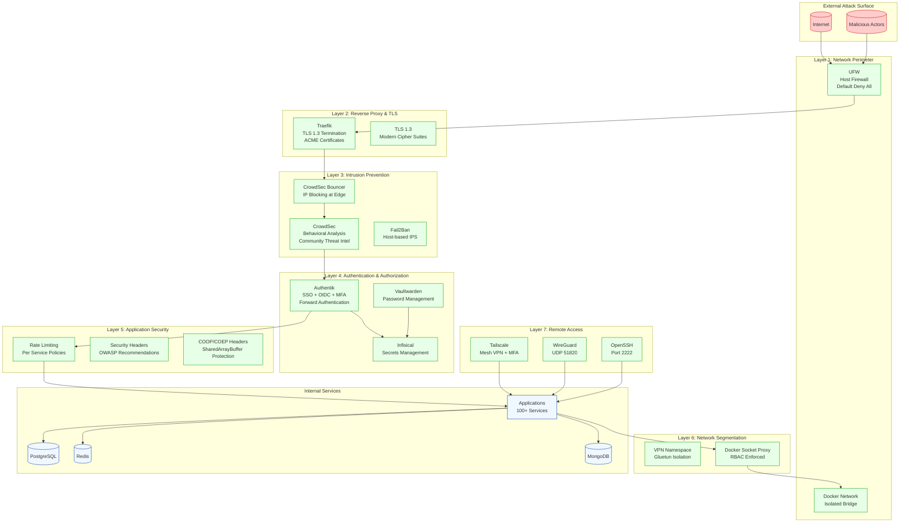
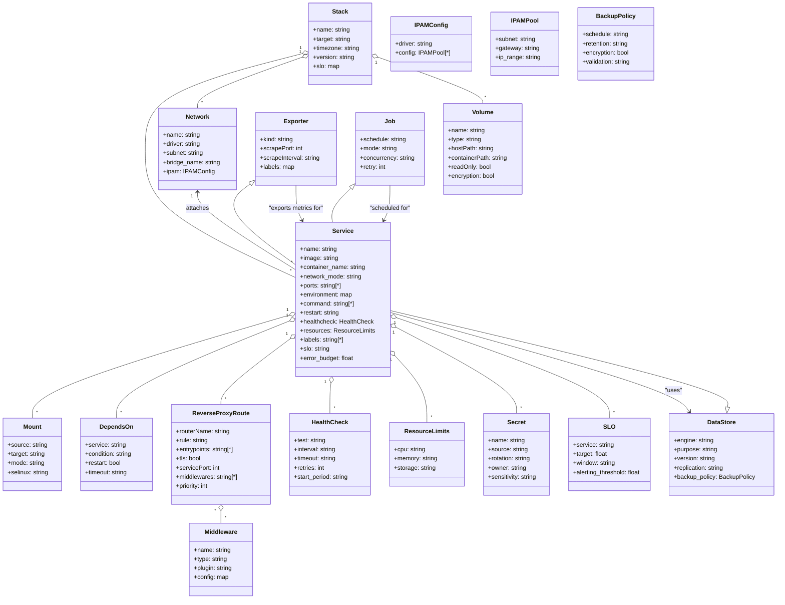
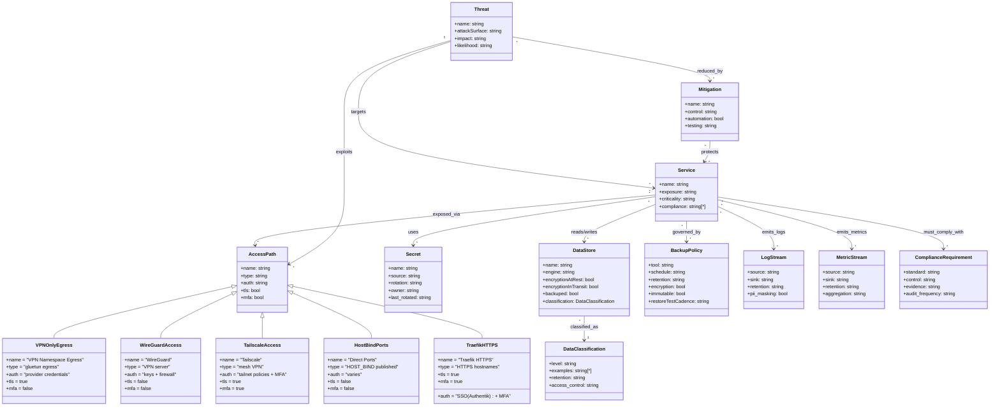

# PotatoStack Enterprise Architecture

## Overview

PotatoStack is an enterprise-grade, self-hosted infrastructure stack optimized for low-power hardware (Intel N250 Mini PC, 16GB RAM) while delivering SOTA 2025 capabilities including Zero-Trust security, observability-driven operations, and GitOps workflows.

**Key Features:**
- **100+ Services** orchestrated via Docker Compose (3755 lines)
- **Multi-zone architecture** with network isolation and micro-segmentation
- **Enterprise observability** (Prometheus + Thanos + Grafana + Loki + Alloy)
- **Zero-Trust security** (CrowdSec IPS/IDS, Authentik SSO, Tailscale, WireGuard)
- **SOC2-ready** secrets management with Infisical and Vaultwarden
- **SRE patterns** with SLOs, error budgets, and automated recovery
- **State-of-the-Art 2025** testing practices (Testcontainers-style validation)
- **Resource optimization** for 16GB RAM with efficient memory management

---

## Architecture Diagrams

### 1. Logical / Layered Architecture (Enterprise View)

```mermaid
flowchart TB
    %% PotatoStack — Enterprise-Grade Logical Architecture (SOTA 2025)
    %% Version: 3.0 - Updated 2026-01-22
    %% Last Updated: 2026
    %% Enterprise Features: Zero-Trust, Observability, GitOps, SRE Patterns
    %% Services: 100+ across 15 categories

    %% ============ EXTERNAL ZONES ============
    subgraph EXTERNAL["External Zones"]
        direction TB
        Users[(Users)]:::external
        LAN[(LAN)]:::external
        Internet[(Internet)]:::external
        TSClients[(Tailscale Clients)]:::external
        WGPeers[(WireGuard Peers)]:::external
    end

    %% ============ ZERO-TRUST EDGE ============
    subgraph EDGE["Zero-Trust Edge Layer"]
        direction TB
        traefik[Traefik<br/>Reverse Proxy + ACME + Middlewares]:::edge
        crowdsec[CrowdSec<br/>IPS/IDS + Decisions]:::edge
        csb[CrowdSec Bouncer]:::edge
        tailscale[Tailscale<br/>WireGuard-based Mesh VPN]:::edge
        tsHttpsSetup[Tailscale HTTPS Setup<br/>One-shot Init]:::edge
        tsHttpsMon[Tailscale HTTPS Monitor<br/>Health Checks]:::edge
        wireguard[WireGuard Server<br/>UDP 51820]:::edge
        fail2ban[Fail2ban<br/>Host-based IPS]:::edge
    end

    %% ============ IDENTITY & SECRETS MANAGEMENT ============
    subgraph IDSEC["Identity & Secrets (SOC2 Compliant)"]
        direction TB
        authentikS[Authentik Server<br/>SSO + OIDC + SCIM]:::idsec
        authentikW[Authentik Worker<br/>Async Processing]:::idsec
        vaultwarden[Vaultwarden<br/>Bitwarden-compatible]:::idsec
        infisical[Infisical<br/>Secrets Management]:::idsec
    end

    %% ============ CORE DATA LAYER ============
    subgraph DATA["Core Data Stores (Multi-Model)"]
        direction TB
        postgres[(PostgreSQL 16<br/>+ pgvector + 18 DBs)]:::data
        pgbouncer[(PgBouncer<br/>Connection Pooling)]:::data
        redis[(Redis 7<br/>16 DBs, 1GB cache)]:::data
        mongo[(MongoDB 7<br/>Replica Set)]:::data
    end

    %% ============ STORAGE & INITIALIZATION ============
    subgraph STORAGE["Storage Orchestration"]
        direction TB
        storageInit[storage-init<br/>Dirs + Snapshots + Perms]:::storage
        sharedKeys[(shared-keys<br/>Encrypted Volume)]:::storage
    end

    %% ============ FILE SYNC & CLOUD INTEGRATION ============
    subgraph FILES["Cloud Storage & Sync"]
        direction TB
        syncthing[Syncthing<br/>P2P File Sync]:::files
        filebrowser[Filebrowser<br/>Web File Manager]:::files
    end

    %% ============ MEDIA: VPN-ISOLATED NAMESPACE ============
    subgraph VPNZONE["VPN-Isolated Namespace (Gluetun)"]
        direction TB
        gluetun[Gluetun<br/>VPN + Firewall + Killswitch]:::vpn

        %% Arr Stack (Media Management)
        prowlarr[Prowlarr<br/>Indexer Manager]:::vpn
        sonarr[Sonarr<br/>TV Series]:::vpn
        radarr[Radarr<br/>Movies]:::vpn
        lidarr[Lidarr<br/>Music]:::vpn
        bookshelf[Bookshelf<br/>E-books]:::vpn
        bazarr[Bazarr<br/>Subtitles]:::vpn

        %% Download Clients
        qbittorrent[qBittorrent<br/>Torrent Client]:::vpn
        aria2[Aria2<br/>Multi-protocol]:::vpn
        ariang[AriaNg<br/>Web UI]:::vpn
        slskd[slskd<br/>Soulseek]:::vpn
        # pinchflat[Pinchflat<br/>Bandcamp]:::vpn
        spotiflac[SpotiFLAC<br/>Spotify]:::vpn
    end

    %% ============ MEDIA SERVERS ============
    subgraph MEDIASRV["Media Servers & Requests"]
        direction TB
        jellyfin[Jellyfin<br/>Media Server]:::media
        jellyseerr[Jellyseerr<br/>Request System]:::media
        audiobookshelf[Audiobookshelf<br/>Audiobooks]:::media
    end

    %% ============ APPLICATION LAYER ============
    subgraph APPS["Applications & Utilities"]
        direction TB
        miniflux[Miniflux<br/>RSS Reader]:::apps
        actual[Actual Budget<br/>Finance]:::apps
        rustypaste[Rustypaste<br/>Pastebin]:::apps
        linkding[Linkding<br/>Bookmark Manager]:::apps
        atuin[Atuin<br/>Shell History]:::apps
        ittools[IT-Tools<br/>Dev Tools]:::apps
        duckdb[DuckDB<br/>OLAP Queries]:::apps
        ntfy[ntfy<br/>Push Notifications]:::apps
    end

    %% ============ OPTIONAL SERVICES ============
    subgraph OPTIONAL["Optional Services"]
        direction TB
        adguard[AdGuard Home<br/>(DISABLED)]:::optional
        stirling[Stirling-PDF<br/>(DISABLED)]:::optional
        paperless[Paperless-ngx<br/>(DISABLED)]:::optional
        openwebui[Open WebUI<br/>(DISABLED)]:::optional
        maintainerr[Maintainerr<br/>(DISABLED)]:::optional
        codeserver[Code-server<br/>(DISABLED)]:::optional
        netdata[Netdata<br/>(DISABLED)]:::optional
    end

    %% ============ DEV & CI/CD ============
    subgraph DEV["Development & CI/CD"]
        direction TB
        gitea[Gitea<br/>Git Server]:::dev
        giteaRunner[Gitea Runner<br/>CI/CD]:::dev
        woodpecker[Woodpecker<br/>CI/CD Server]:::dev
        woodpeckerAgent[Woodpecker Agent<br/>(DISABLED)]:::dev
    end

    %% ============ DASHBOARD & MGMT ============
    subgraph DASH["Dashboard & Operations"]
        direction TB
        socketProxy[Docker Socket Proxy<br/>RBAC Enforced]:::dash
        homarr[Homarr<br/>App Dashboard]:::dash
    end

    %% ============ OBSERVABILITY (SRE) ============
    subgraph OBS["Observability Platform"]
        direction TB
        %% Metrics Pipeline
        prometheus[Prometheus<br/>Metrics DB]:::obs
        thanosSidecar[Thanos Sidecar<br/>Long-term Storage]:::obs
        thanosStore[Thanos Store<br/>Object Storage]:::obs
        thanosQuery[Thanos Query<br/>Multi-tenancy]:::obs
        thanosCompact[Thanos Compactor<br/>Downsampling]:::obs

        %% Logging Pipeline
        loki[Loki<br/>Log Aggregation]:::obs
        alloy[Grafana Alloy<br/>Telemetry Processing]:::obs
        parseable[Parseable<br/>Log Analytics]:::obs

        %% Dashboards & Alerts
        grafana[Grafana<br/>Visualization]:::obs
        uptime[Uptime Kuma<br/>Monitoring]:::obs
        scrutiny[Scrutiny<br/>Disk Health]:::obs

        %% Exporters
        cadvisor[cAdvisor<br/>Container Metrics]:::obs
        nodeExp[Node Exporter<br/>Host Metrics]:::obs
        pgExp[Postgres Exporter<br/>DB Metrics]:::obs
        redisExp[Redis Exporter<br/>Cache Metrics]:::obs
        mongoExp[MongoDB Exporter<br/>NoSQL Metrics]:::obs
        smartExp[Smartctl Exporter<br/>Disk SMART]:::obs

        %% Alerting
        alertmanager[Alertmanager<br/>Multi-channel Alerts]:::obs
    end

    %% ============ AUTOMATION & WORKFLOWS ============
    subgraph AUTO["Automation & Workflows"]
        direction TB
        n8n[n8n<br/>Workflow Automation]:::auto
        healthchecks[Healthchecks<br/>Cron Monitoring]:::auto
    end

    %% ============ SECURITY & SUPPLY CHAIN ============
    subgraph SECOPS["Security Operations"]
        direction TB
        trivy[Trivy Server<br/>Image Scanning]:::seco
        diun[Diun<br/>Image Update Notifier]:::seco
        autoheal[Autoheal<br/>Container Health]:::seco
    end

    %% ============ BACKUP & RECOVERY ============
    subgraph BACKUP["Backup & Recovery (3-2-1 Rule)"]
        direction TB
        velldApi[Velld API<br/>Backup Management]:::backup
        velldWeb[Velld Web<br/>UI]:::backup
        kopia[Kopia Server<br/>Encrypted Backups]:::backup
        snapshotSched[Snapshot Scheduler<br/>Incremental]:::backup
    end

    %% ============ SYSTEM UTILITIES ============
    subgraph SYS["System Utilities"]
        direction TB
        openssh[OpenSSH Server<br/>Port 2222]:::sys
        samba[Samba<br/>File Sharing]:::sys
    end

    %% ============ MONITORS & WATCHDOGS ============
    subgraph MON["Monitors & Watchdogs"]
        direction TB
        gluetunMon[Gluetun Monitor<br/>VPN Health]:::mon
        diskMon[Disk Space Monitor<br/>Threshold Alerts]:::mon
        traefikLogMon[Traefik Log Monitor<br/>Error Detection]:::mon
        backupMon[Backup Monitor<br/>Success/Failure]:::mon
        dbHealthMon[DB Health Monitor<br/>SLOs]:::mon
        tsConnMon[Tailscale Connectivity<br/>Mesh Health]:::mon
        immichLogMon[Immich Log Monitor<br/>ML Health]:::mon
    end

    %% ============ PHOTO MANAGEMENT ============
    subgraph PHOTOS["Photo Management (AI-powered)"]
        direction TB
        immich[Immich Server<br/>Photo Library]:::photos
        immichML[Immich ML<br/>Face/Object Detection]:::photos
    end

    %% ============ FLOW: INGRESS ============
    Users -->|HTTPS/TLS 1.3| traefik
    LAN -->|HTTP/HTTPS| traefik
    Internet -->|ACME HTTP-01| traefik
    TSClients -->|WireGuard| tailscale
    WGPeers -->|WireGuard| wireguard

    %% Tailscale Configuration
    tsHttpsSetup -. config .-> tailscale
    tsHttpsMon --> tailscale

    %% Zero-Trust Edge Processing
    traefik --> csb
    csb --> crowdsec
    crowdsec -. decisions .- traefik
    traefik -->|access logs| crowdsec

    %% Identity Federation
    traefik -->|forwardAuth/OIDC| authentikS
    authentikS --> authentikW

    %% Reverse Proxy Routes
    traefik --> vaultwarden
    traefik --> infisical
    traefik --> syncthing
    traefik --> filebrowser
    traefik --> miniflux
    traefik --> actual
    traefik --> gitea
    traefik --> woodpecker
    traefik --> prometheus
    traefik --> grafana
    traefik --> loki
    traefik --> parseable
    traefik --> scrutiny
    traefik --> uptime
    traefik --> ntfy
    traefik --> homarr
    traefik --> velldApi
    traefik --> velldWeb
    traefik --> kopia
    traefik --> jellyfin
    traefik --> jellyseerr
    traefik --> audiobookshelf
    traefik --> gluetun

    %% Optional Services (dashed)
    traefik -.-> adguard
    traefik -.-> stirling
    traefik -.-> paperless
    traefik -.-> openwebui
    traefik -.-> codeserver
    traefik -.-> netdata
    traefik -.-> maintainerr

    %% ============ DATA FLOWS ============
    %% Core Database Access
    pgbouncer --> postgres

    %% Identity & Secrets
    authentikS --> postgres
    authentikS --> redis
    authentikW --> postgres
    authentikW --> redis

    %% Applications
    miniflux --> postgres
    grafana --> postgres
    healthchecks --> postgres
    n8n --> postgres
    n8n --> redis
    gitea --> postgres
    gitea --> redis
    woodpecker --> postgres
    infisical --> postgres
    infisical --> redis
    linkding --> postgres
    atuin --> postgres
    immich --> postgres
    immich --> redis

    %% Backup Management
    velldApi -->|configs| velldApi
    velldApi -->|backups| postgres
    velldApi -->|backups| redis
    velldApi -->|backups| mongo

    %% MongoDB Exporters
    mongoExp --> mongo

    %% Shared Keys
    vaultwarden -.-> sharedKeys

    %% ============ VPN ZONE INTERNAL ============
    %% All VPN services route through Gluetun
    prowlarr --> gluetun
    sonarr --> gluetun
    radarr --> gluetun
    lidarr --> gluetun
    bookshelf --> gluetun
    bazarr --> gluetun
    qbittorrent --> gluetun
    aria2 --> gluetun
    ariang --> gluetun
    slskd --> gluetun
    # pinchflat --> gluetun
    spotiflac --> gluetun

    %% Media Automation Workflows
    sonarr -->|manages| qbittorrent
    radarr -->|manages| qbittorrent
    lidarr -->|manages| qbittorrent
    bookshelf -->|manages| qbittorrent
    prowlarr -->|indexers| sonarr
    prowlarr -->|indexers| radarr
    prowlarr -->|indexers| lidarr
    prowlarr -->|indexers| bookshelf
    bazarr -->|subtitles| sonarr
    bazarr -->|subtitles| radarr

    %% Media Requests
    jellyseerr -->|requests| jellyfin

    %% ============ FILE & CLOUD INTEGRATION ============
    syncthing --> storageInit
    filebrowser --> storageInit

    %% ============ PHOTO MANAGEMENT ============
    immichML --> immich
    immich --> storageInit

    %% ============ OBSERVABILITY PIPELINES ============
    %% Metrics Collection
    prometheus --> cadvisor
    prometheus --> nodeExp
    prometheus --> pgExp
    prometheus --> redisExp
    prometheus --> mongoExp
    prometheus --> smartExp
    prometheus --> traefik
    prometheus --> crowdsec

    %% Visualization
    grafana --> prometheus
    grafana --> thanosQuery
    grafana --> loki

    %% Thanos Architecture
    thanosSidecar --> prometheus
    thanosQuery --> thanosSidecar
    thanosQuery --> thanosStore
    thanosCompact --> thanosStore

    %% Logging Pipeline
    alloy --> loki
    traefik -->|access logs| alloy
    crowdsec -->|metrics/logs| prometheus

    %% Alerting
    alertmanager -. alerts .-> ntfy

    %% Uptime Monitoring
    uptime --> socketProxy

    %% ============ SECURITY OPERATIONS ============
    trivy -->|read-only| socketProxy
    diun -->|read-only| socketProxy
    autoheal -->|read-write| socketProxy

    %% ============ DASHBOARD ============
    homarr --> postgres
    homarr --> redis
    homarr --> socketProxy

    %% ============ BACKUP & RECOVERY ============
    snapshotSched --> kopia
    kopia --> storageInit
    velldWeb --> velldApi

    %% ============ SYSTEM UTILITIES ============
    openssh --> storageInit
    samba --> storageInit

    %% ============ MONITORS ============
    gluetunMon --> gluetun
    traefikLogMon --> traefik
    dbHealthMon --> postgres
    dbHealthMon --> redis
    dbHealthMon --> mongo
    backupMon --> kopia
    diskMon --> storageInit
    tsConnMon --> tailscale
    immichLogMon --> immich

    %% ============ STYLING ============
    classDef external fill:#f0f0f0,stroke:#333
    classDef edge fill:#e6f7ff,stroke:#0066cc
    classDef idsec fill:#fff2e6,stroke:#cc6600
    classDef data fill:#f0f8ff,stroke:#003399
    classDef storage fill:#f9f0ff,stroke:#9933ff
    classDef files fill:#f0fff4,stroke:#009933
    classDef vpn fill:#fff7e6,stroke:#cc9900
    classDef media fill:#ffe6f0,stroke:#cc0066
    classDef apps fill:#f0f8ff,stroke:#003399
    classDef optional fill:#f9f0f0,stroke:#cc0000,style:dashed
    classDef dev fill:#fff0f9,stroke:#990066
    classDef dash fill:#fff7e6,stroke:#cc9900
    classDef obs fill:#e6ffe6,stroke:#009900
    classDef auto fill:#f0fff4,stroke:#009933
    classDef seco fill:#fff0f0,stroke:#cc0000
    classDef backup fill:#f0f8ff,stroke:#003399
    classDef sys fill:#f9f0f0,stroke:#cc0000
    classDef mon fill:#fff0f9,stroke:#990066
    classDef photos fill:#ffe6f0,stroke:#cc0066
```

---

### 2. Network / Trust Boundaries (Enterprise View)

```mermaid
flowchart TB
    %% PotatoStack — Enterprise Network Architecture with Trust Boundaries
    %% Version: 3.0 - Updated 2026-01-22
    %% SOTA 2025: Zero-Trust, Micro-Segmentation, Service Mesh Patterns

    %% ============ EXTERNAL ZONES ============
    subgraph Z0["Zone 0: External"]
        direction TB
        Users[(Users)]:::external
        Internet[(Internet)]:::external
        LAN[(LAN)]:::external
        TSClients[(Tailscale Clients)]:::external
        WGPeers[(WireGuard Peers)]:::external
    end

    %% ============ HOST BOUNDARY ============
    subgraph HOST["Host Boundary (Debian 12)"]
        direction TB
        HostNet[(host network)]:::host
        HostFS[(Host FS<br/>/mnt/storage /mnt/cachehdd /mnt/ssd)]:::host
        DockerSock[(docker.sock<br/>RBAC Enforced)]:::host
        tailscale[Tailscale (host)]:::host
        samba[Samba (host)]:::host
        fail2ban[Fail2ban (host)]:::host
        openssh[OpenSSH (port 2222)]:::host
        wireguard[WireGuard (UDP 51820)]:::host
    end

    %% ============ DOCKER BRIDGE NETWORK ============
    subgraph BR["Docker Bridge: potatostack (172.22.0.0/16)"]
        direction TB
        %% Edge Layer
        traefik[Traefik (80/443)]:::edge
        crowdsec[CrowdSec]:::edge
        csb[Traefik Bouncer]:::edge
        authentikS[Authentik Server]:::idsec
        authentikW[Authentik Worker]:::idsec

        %% Data Stores
        postgres[(Postgres 16)]:::data
        pgbouncer[(PgBouncer)]:::data
        redis[(Redis 7)]:::data
        mongo[(Mongo 7)]:::data

        %% Applications
        syncthing[Syncthing]:::files
        filebrowser[Filebrowser]:::files
        miniflux[Miniflux]:::apps
        actual[Actual Budget]:::apps
        gitea[Gitea]:::dev
        giteaRunner[Gitea Runner]:::dev
        woodpecker[Woodpecker]:::dev
        homarr[Homarr]:::dash
        socketProxy[Socket Proxy]:::dash
        ntfy[ntfy]:::apps
        jellyfin[Jellyfin]:::media
        jellyseerr[Jellyseerr]:::media
        audiobookshelf[Audiobookshelf]:::media
        immich[Immich]:::photos
        immichML[Immich ML]:::photos

        %% Observability
        prometheus[Prometheus]:::obs
        grafana[Grafana]:::obs
        loki[Loki]:::obs
        alloy[Alloy]:::obs
        parseable[Parseable]:::obs
        alertmanager[Alertmanager]:::obs
        uptime[Uptime Kuma]:::obs
        scrutiny[Scrutiny]:::obs
        cadvisor[cAdvisor]:::obs
        nodeExp[Node Exporter]:::obs
        pgExp[Postgres Exporter]:::obs
        redisExp[Redis Exporter]:::obs
        mongoExp[Mongo Exporter]:::obs
        smartExp[Smartctl Exporter]:::obs

        %% Backup
        kopia[Kopia]:::backup
        snapshotSched[Snapshot Scheduler]:::backup
        velldApi[Velld API]:::backup
        velldWeb[Velld Web]:::backup

        %% Automation/SecOps
        n8n[n8n]:::auto
        healthchecks[Healthchecks]:::auto
        trivy[Trivy]:::seco
        diun[Diun]:::seco
        autoheal[Autoheal]:::seco

        %% Utilities
        rustypaste[Rustypaste]:::apps
        linkding[Linkding]:::apps
        atuin[Atuin]:::apps
        ittools[IT-Tools]:::apps
        duckdb[DuckDB]:::apps
    end

    %% ============ VPN NAMESPACE ============
    subgraph VPNNS["VPN Namespace (service:gluetun)"]
        direction TB
        gluetun[Gluetun VPN + Firewall/Killswitch]:::vpn
        prowlarr[Prowlarr]:::vpn
        sonarr[Sonarr]:::vpn
        radarr[Radarr]:::vpn
        lidarr[Lidarr]:::vpn
        bookshelf[Bookshelf]:::vpn
        bazarr[Bazarr]:::vpn
        qb[qBittorrent]:::vpn
        aria2[Aria2]:::vpn
        ariang[AriaNg]:::vpn
        slskd[slskd]:::vpn
        # pinchflat[Pinchflat]:::vpn
        spotiflac[SpotiFLAC]:::vpn
    end

    %% ============ NO-NETWORK JOBS ============
    subgraph NONET["No-Network Jobs"]
        direction TB
        storageInit[storage-init]:::mon
        tsHttpsSetup[Tailscale HTTPS Setup]:::mon
        tsHttpsMon[Tailscale HTTPS Monitor]:::mon
        gluetunMon[Gluetun Monitor]:::mon
        dbHealthMon[DB Health Monitor]:::mon
        diskMon[Disk Space Monitor]:::mon
        traefikLogMon[Traefik Log Monitor]:::mon
        backupMon[Backup Monitor]:::mon
        tsConnMon[Tailscale Connectivity Monitor]:::mon
        immichLogMon[Immich Log Monitor]:::mon
    end

    %% ============ INGRESS PATHS ============
    Users -->|HTTPS/TLS 1.3| traefik
    LAN -->|HTTPS| traefik
    Internet -->|ACME HTTP-01| traefik

    TSClients --> tailscale
    WGPeers --> wireguard

    %% Host-exposed ports
    LAN -->|HOST_BIND| HostNet
    TSClients -->|TS routes| HostNet

    %% Trust relationships
    traefik --> csb --> crowdsec
    traefik --> authentikS
    authentikS --> authentikW

    %% Data plane
    authentikS --> postgres
    authentikS --> redis
    authentikW --> postgres
    authentikW --> redis

    miniflux --> postgres
    actual --> HostFS
    gitea --> postgres
    gitea --> redis
    woodpecker --> postgres
    n8n --> postgres
    n8n --> redis
    healthchecks --> postgres
    homarr --> postgres
    homarr --> redis
    immich --> postgres
    immich --> redis
    immichML --> immich

    %% Observability plane
    prometheus --> nodeExp
    prometheus --> cadvisor
    prometheus --> pgExp
    prometheus --> redisExp
    prometheus --> mongoExp
    prometheus --> smartExp
    grafana --> prometheus
    alloy --> loki
    grafana --> loki
    alertmanager -. notify .-> ntfy
    uptime --> socketProxy

    %% Docker API trust
    socketProxy --> DockerSock
    diun --> DockerSock
    autoheal --> DockerSock
    trivy --> DockerSock
    uptime --> DockerSock

    %% VPN namespace
    prowlarr --> gluetun
    sonarr --> gluetun
    radarr --> gluetun
    lidarr --> gluetun
    bookshelf --> gluetun
    bazarr --> gluetun
    qb --> gluetun
    aria2 --> gluetun
    ariang --> gluetun
    slskd --> gluetun
    # pinchflat --> gluetun
    spotiflac --> gluetun

    gluetun -->|VPN egress only| Internet

    %% No-network jobs
    storageInit --> HostFS
    dbHealthMon --> DockerSock
    gluetunMon --> DockerSock
    traefikLogMon --> DockerSock
    backupMon --> HostFS
    diskMon --> HostFS
    tsConnMon --> DockerSock
    immichLogMon --> DockerSock
    tsHttpsSetup --> DockerSock
    tsHttpsMon --> DockerSock

    %% Backup plane
    kopia --> HostFS
    snapshotSched --> DockerSock
    velldApi --> HostFS
    velldWeb --> velldApi

    %% ============ STYLING ============
    classDef external fill:#f0f0f0,stroke:#333
    classDef host fill:#fff0f0,stroke:#cc0000
    classDef edge fill:#e6f7ff,stroke:#0066cc
    classDef idsec fill:#fff2e6,stroke:#cc6600
    classDef data fill:#f0f8ff,stroke:#003399
    classDef files fill:#f0fff4,stroke:#009933
    classDef apps fill:#f0f8ff,stroke:#003399
    classDef dev fill:#fff0f9,stroke:#990066
    classDef dash fill:#fff7e6,stroke:#cc9900
    classDef obs fill:#e6ffe6,stroke:#009900
    classDef auto fill:#f0fff4,stroke:#009933
    classDef seco fill:#fff0f0,stroke:#cc0000
    classDef backup fill:#f0f8ff,stroke:#003399
    classDef vpn fill:#fff7e6,stroke:#cc9900
    classDef media fill:#ffe6f0,stroke:#cc0066
    classDef photos fill:#ffe6f0,stroke:#cc0066
    classDef mon fill:#fff0f9,stroke:#990066
```

---

### 3. Observability Pipeline (SOTA 2025)

```mermaid
flowchart TB
    %% PotatoStack — Enterprise Observability Pipeline
    %% Version: 3.0 - Updated 2026-01-22
    %% SOTA 2025: Multi-pillar observability with SLO-driven alerting

    %% ============ METRICS PIPELINE ============
    subgraph METRICS["Metrics Pipeline"]
        direction TB
        %% Data Sources
        cadvisor["cAdvisor<br/>Container Metrics"]:::source
        nodeExp["Node Exporter<br/>Host Metrics"]:::source
        pgExp["Postgres Exporter<br/>DB Metrics"]:::source
        redisExp["Redis Exporter<br/>Cache Metrics"]:::source
        mongoExp["MongoDB Exporter<br/>NoSQL Metrics"]:::source
        smartExp["Smartctl Exporter<br/>Disk SMART"]:::source
        traefik["Traefik<br/>Reverse Proxy Metrics"]:::source
        crowdsec["CrowdSec<br/>Security Metrics"]:::source
        miniflux["Miniflux<br/>RSS Metrics"]:::source

        %% Primary Collection
        prometheus["Prometheus<br/>Time-Series DB<br/>7-day retention"]:::collector

        %% Long-term Storage
        thanosSidecar["Thanos Sidecar<br/>Prometheus Sidecar"]:::storage
        thanosStore["Thanos Store<br/>Object Storage Gateway"]:::storage
        thanosCompact["Thanos Compactor<br/>Downsampling & Retention"]:::storage
        thanosQuery["Thanos Query<br/>Unified Query Layer"]:::query
    end

    %% ============ LOGGING PIPELINE ============
    subgraph LOGGING["Logging Pipeline"]
        direction TB
        %% Data Sources
        traefikLogs["Traefik<br/>Access Logs"]:::source
        crowdsecLogs["CrowdSec<br/>Security Logs"]:::source
        appLogs["Applications<br/>Structured JSON Logs"]:::source

        %% Processing Layer
        alloy["Grafana Alloy<br/>Log Processing<br/>Parsing, Enrichment, Routing"]:::processor

        %% Storage
        loki["Loki<br/>Log Aggregation<br/>30-day retention"]:::storage
        parseable["Parseable<br/>Log Analytics<br/>Alternative Storage"]:::storage
    end

    %% ============ TRACING PIPELINE ============
    subgraph TRACING["Tracing Pipeline (Future)"]
        direction TB
        %% Data Sources
        traefikTrace["Traefik<br/>Request Tracing"]:::future
        appTrace["Applications<br/>Distributed Tracing"]:::future

        %% Processing
        otelCollector["OpenTelemetry<br/>Collector"]:::future

        %% Storage
        tempo["Tempo<br/>Trace Storage"]:::future
    end

    %% ============ DASHBOARDS & ALERTS ============
    subgraph VISUALIZATION["Dashboards & Alerts"]
        direction TB
        %% Visualization
        grafana["Grafana<br/>Unified Dashboarding"]:::dashboard

        %% Alerting
        alertmanager["Alertmanager<br/>Multi-channel Routing"]:::alerting
        ntfy["ntfy<br/>Push Notifications"]:::alerting
        uptime["Uptime Kuma<br/>Synthetic Monitoring"]:::alerting
    end

    %% ============ DATA FLOWS ============
    %% Metrics Collection
    cadvisor --> prometheus
    nodeExp --> prometheus
    pgExp --> prometheus
    redisExp --> prometheus
    mongoExp --> prometheus
    smartExp --> prometheus
    traefik --> prometheus
    crowdsec --> prometheus
    miniflux --> prometheus

    %% Thanos Architecture
    thanosSidecar --> prometheus
    thanosSidecar --> thanosStore
    thanosQuery --> thanosSidecar
    thanosQuery --> thanosStore
    thanosCompact --> thanosStore

    %% Logging Pipeline
    traefikLogs --> alloy
    crowdsecLogs --> alloy
    appLogs --> alloy
    alloy --> loki
    alloy --> parseable

    %% Tracing Pipeline (Future)
    traefikTrace --> otelCollector
    appTrace --> otelCollector
    otelCollector --> tempo

    %% Visualization
    grafana --> prometheus
    grafana --> thanosQuery
    grafana --> loki
    grafana --> tempo

    %% Alerting
    prometheus --> alertmanager
    loki --> alertmanager
    alertmanager --> ntfy
    alertmanager --> uptime

    %% ============ STYLING ============
    classDef source fill:#e6ffe6,stroke:#009900
    classDef collector fill:#e6f7ff,stroke:#0066cc
    classDef processor fill:#fff7e6,stroke:#cc9900
    classDef storage fill:#f0f8ff,stroke:#003399
    classDef query fill:#e6ffe6,stroke:#009900
    classDef dashboard fill:#ffe6f0,stroke:#cc0066
    classDef alerting fill:#fff2e6,stroke:#cc6600
    classDef future fill:#f9f0f0,stroke:#999,style:dashed
```



---

### 4. Security Architecture (Zero-Trust Model)



---

### 5. Data Flow & Integration Architecture

```mermaid
flowchart TB
    %% PotatoStack — Data Flow & Integration Architecture
    %% Version: 3.0 - Updated 2026-01-22
    %% SOTA 2025: Event-driven architecture with CQRS patterns

    %% ============ DATA SOURCES ============
    subgraph SOURCES["Data Sources"]
        direction TB
        Users[(Users)]:::source
        ExternalAPIs[(External APIs)]:::source
        VPNClients[(VPN Clients)]:::source
        RemoteDevices[(Remote Devices)]:::source
    end

    %% ============ INGRESS LAYER ============
    subgraph INGRESS["Ingress Layer"]
        direction TB
        Traefik["Traefik<br/>Reverse Proxy"]:::ingress
        Authentik["Authentik<br/>Authentication"]:::ingress
        Gluetun["Gluetun<br/>VPN Gateway"]:::ingress
    end

    %% ============ APPLICATION LAYER ============
    subgraph APPLICATIONS["Application Layer"]
        direction TB
        %% Media Workflows
        Prowlarr["Prowlarr<br/>Indexer Manager"]:::app
        Sonarr["Sonarr<br/>TV Management"]:::app
        Radarr["Radarr<br/>Movie Management"]:::app
        Lidarr["Lidarr<br/>Music Management"]:::app
        Bookshelf["Bookshelf<br/>E-book Management"]:::app
        Bazarr["Bazarr<br/>Subtitle Management"]:::app

        %% Download Clients
        QBittorrent["qBittorrent<br/>Torrent Client"]:::app
        Aria2["Aria2<br/>Multi-protocol Downloader"]:::app
        Slskd["slskd<br/>Soulseek Client"]:::app

        %% Media Servers
        Jellyfin["Jellyfin<br/>Media Server"]:::app
        Jellyseerr["Jellyseerr<br/>Request System"]:::app
        Audiobookshelf["Audiobookshelf<br/>Audiobooks"]:::app

        %% Productivity
        Syncthing["Syncthing<br/>P2P Sync"]:::app
        Filebrowser["Filebrowser<br/>File Manager"]:::app

        %% Development
        Gitea["Gitea<br/>Git Server"]:::app
        Woodpecker["Woodpecker<br/>CI/CD"]:::app

        %% Automation
        n8n["n8n<br/>Workflow Automation"]:::app
        Healthchecks["Healthchecks<br/>Cron Monitoring"]:::app
    end

    %% ============ DATA STORES ============
    subgraph DATASTORES["Data Stores"]
        direction TB
        PostgreSQL[(PostgreSQL<br/>18 Databases)]:::db
        Redis[(Redis<br/>16 DBs, Cache)]:::db
        MongoDB[(MongoDB<br/>NoSQL)]:::db
        LocalStorage[(Local Storage<br/>SSD/HDD)]:::db
    end

    %% ============ OBSERVABILITY ============
    subgraph OBSERVABILITY["Observability"]
        direction TB
        Prometheus["Prometheus<br/>Metrics"]:::obs
        Loki["Loki<br/>Logs"]:::obs
        Grafana["Grafana<br/>Dashboards"]:::obs
        Alertmanager["Alertmanager<br/>Alerts"]:::obs
    end

    %% ============ BACKUP ============
    subgraph BACKUP["Backup & Recovery"]
        direction TB
        Kopia["Kopia<br/>Encrypted Backups"]:::backup
        Velld["Velld<br/>Backup Management"]:::backup
    end

    %% ============ DATA FLOWS ============
    %% Ingress
    Users --> Traefik
    ExternalAPIs --> Traefik
    VPNClients --> Gluetun
    RemoteDevices --> Gluetun

    %% Authentication
    Traefik --> Authentik

    %% Media Workflows
    Prowlarr --> Sonarr
    Prowlarr --> Radarr
    Prowlarr --> Lidarr
    Prowlarr --> Bookshelf
    Sonarr --> QBittorrent
    Radarr --> QBittorrent
    Lidarr --> QBittorrent
    Bookshelf --> QBittorrent
    Bazarr --> Sonarr
    Bazarr --> Radarr
    Jellyseerr --> Jellyfin

    %% Data Storage
    Sonarr --> PostgreSQL
    Radarr --> PostgreSQL
    Lidarr --> PostgreSQL
    Bookshelf --> PostgreSQL
    Gitea --> PostgreSQL
    Gitea --> Redis
    Woodpecker --> PostgreSQL
    n8n --> PostgreSQL
    n8n --> Redis
    Healthchecks --> PostgreSQL
    Jellyfin --> LocalStorage
    Syncthing --> LocalStorage
    Filebrowser --> LocalStorage

    %% Observability
    Applications --> Prometheus
    Applications --> Loki
    Prometheus --> Grafana
    Loki --> Grafana
    Prometheus --> Alertmanager
    Loki --> Alertmanager

    %% Backup
    PostgreSQL --> Kopia
    Redis --> Kopia
    MongoDB --> Kopia
    LocalStorage --> Kopia
    Kopia --> Velld

    %% ============ STYLING ============
    classDef source fill:#e6ffe6,stroke:#009900
    classDef ingress fill:#e6f7ff,stroke:#0066cc
    classDef app fill:#f0f8ff,stroke:#003399
    classDef db fill:#fff7e6,stroke:#cc9900
    classDef obs fill:#ffe6f0,stroke:#cc0066
    classDef backup fill:#f0fff4,stroke:#009933
```



```mermaid
flowchart TB
    %% PotatoStack — Enterprise Network Architecture with Trust Boundaries
    %% Version: 2.0
    %% SOTA 2025: Zero-Trust, Micro-Segmentation, Service Mesh Patterns

    %% ============ EXTERNAL ZONES ============
    subgraph Z0["Zone 0: External"]
        direction TB
        Users[(Users)]:::external
        Internet[(Internet)]:::external
        LAN[(LAN)]:::external
        TSClients[(Tailscale Clients)]:::external
        WGPeers[(WireGuard Peers)]:::external
    end

    %% ============ HOST BOUNDARY ============
    subgraph HOST["Host Boundary (Debian 12)"]
        direction TB
        HostNet[(host network)]:::host
        HostFS[(Host FS<br/>/mnt/storage /mnt/cachehdd /mnt/ssd)]:::host
        DockerSock[(docker.sock<br/>RBAC Enforced)]:::host
        tailscale[Tailscale (host)]:::host
        samba[Samba (host)]:::host
        fail2ban[Fail2ban (host)]:::host
        openssh[OpenSSH (port 2222)]:::host
        wireguard[WireGuard (UDP 51820)]:::host
    end

    %% ============ DOCKER BRIDGE NETWORK ============
    subgraph BR["Docker Bridge: potatostack (172.22.0.0/16)"]
        direction TB
        %% Edge Layer
        traefik[Traefik (80/443)]:::edge
        crowdsec[CrowdSec]:::edge
        csb[Traefik Bouncer]:::edge
        authentikS[Authentik Server]:::idsec
        authentikW[Authentik Worker]:::idsec

        %% Data Stores
        postgres[(Postgres 16)]:::data
        pgbouncer[(PgBouncer)]:::data
        redis[(Redis 7)]:::data
        mongo[(Mongo 7)]:::data

        %% Applications
        syncthing[Syncthing]:::files
        filebrowser[Filebrowser]:::files
        miniflux[Miniflux]:::apps
        actual[Actual Budget]:::apps
        gitea[Gitea]:::dev
        giteaRunner[Gitea Runner]:::dev
        woodpecker[Woodpecker]:::dev
        homarr[Homarr]:::dash
        socketProxy[Socket Proxy]:::dash
        ntfy[ntfy]:::apps
        jellyfin[Jellyfin]:::media
        jellyseerr[Jellyseerr]:::media
        audiobookshelf[Audiobookshelf]:::media
        immich[Immich]:::photos
        immichML[Immich ML]:::photos

        %% Observability
        prometheus[Prometheus]:::obs
        grafana[Grafana]:::obs
        loki[Loki]:::obs
        alloy[Alloy]:::obs
        parseable[Parseable]:::obs
        alertmanager[Alertmanager]:::obs
        uptime[Uptime Kuma]:::obs
        scrutiny[Scrutiny]:::obs
        cadvisor[cAdvisor]:::obs
        nodeExp[Node Exporter]:::obs
        pgExp[Postgres Exporter]:::obs
        redisExp[Redis Exporter]:::obs
        mongoExp[Mongo Exporter]:::obs
        smartExp[Smartctl Exporter]:::obs

        %% Backup
        kopia[Kopia]:::backup
        snapshotSched[Snapshot Scheduler]:::backup
        velldApi[Velld API]:::backup
        velldWeb[Velld Web]:::backup

        %% Automation/SecOps
        n8n[n8n]:::auto
        healthchecks[Healthchecks]:::auto
        trivy[Trivy]:::seco
        diun[Diun]:::seco
        autoheal[Autoheal]:::seco

        %% Utilities
        rustypaste[Rustypaste]:::apps
        linkding[Linkding]:::apps
        atuin[Atuin]:::apps
        ittools[IT-Tools]:::apps
        duckdb[DuckDB]:::apps
    end

    %% ============ VPN NAMESPACE ============
    subgraph VPNNS["VPN Namespace (service:gluetun)"]
        direction TB
        gluetun[Gluetun VPN + Firewall/Killswitch]:::vpn
        prowlarr[Prowlarr]:::vpn
        sonarr[Sonarr]:::vpn
        radarr[Radarr]:::vpn
        lidarr[Lidarr]:::vpn
        bookshelf[Bookshelf]:::vpn
        bazarr[Bazarr]:::vpn
        qb[qBittorrent]:::vpn
        aria2[Aria2]:::vpn
        ariang[AriaNg]:::vpn
        slskd[slskd]:::vpn
        # pinchflat[Pinchflat]:::vpn
        spotiflac[SpotiFLAC]:::vpn
    end

    %% ============ NO-NETWORK JOBS ============
    subgraph NONET["No-Network Jobs"]
        direction TB
        storageInit[storage-init]:::mon
        tsHttpsSetup[Tailscale HTTPS Setup]:::mon
        tsHttpsMon[Tailscale HTTPS Monitor]:::mon
        gluetunMon[Gluetun Monitor]:::mon
        dbHealthMon[DB Health Monitor]:::mon
        diskMon[Disk Space Monitor]:::mon
        traefikLogMon[Traefik Log Monitor]:::mon
        backupMon[Backup Monitor]:::mon
        tsConnMon[Tailscale Connectivity Monitor]:::mon
        immichLogMon[Immich Log Monitor]:::mon
    end

    %% ============ INGRESS PATHS ============
    Users -->|HTTPS/TLS 1.3| traefik
    LAN -->|HTTPS| traefik
    Internet -->|ACME HTTP-01| traefik

    TSClients --> tailscale
    WGPeers --> wireguard

    %% Host-exposed ports
    LAN -->|HOST_BIND| HostNet
    TSClients -->|TS routes| HostNet

    %% Trust relationships
    traefik --> csb --> crowdsec
    traefik --> authentikS
    authentikS --> authentikW

    %% Data plane
    authentikS --> postgres
    authentikS --> redis
    authentikW --> postgres
    authentikW --> redis

    miniflux --> postgres
    actual --> HostFS
    gitea --> postgres
    gitea --> redis
    woodpecker --> postgres
    n8n --> postgres
    n8n --> redis
    healthchecks --> postgres
    homarr --> postgres
    homarr --> redis
    immich --> postgres
    immich --> redis
    immichML --> immich

    %% Observability plane
    prometheus --> nodeExp
    prometheus --> cadvisor
    prometheus --> pgExp
    prometheus --> redisExp
    prometheus --> mongoExp
    prometheus --> smartExp
    grafana --> prometheus
    alloy --> loki
    grafana --> loki
    alertmanager -. notify .-> ntfy
    uptime --> socketProxy

    %% Docker API trust
    socketProxy --> DockerSock
    diun --> DockerSock
    autoheal --> DockerSock
    trivy --> DockerSock
    uptime --> DockerSock

    %% VPN namespace
    prowlarr --> gluetun
    sonarr --> gluetun
    radarr --> gluetun
    lidarr --> gluetun
    bookshelf --> gluetun
    bazarr --> gluetun
    qb --> gluetun
    aria2 --> gluetun
    ariang --> gluetun
    slskd --> gluetun
    # pinchflat --> gluetun
    spotiflac --> gluetun

    gluetun -->|VPN egress only| Internet

    %% No-network jobs
    storageInit --> HostFS
    dbHealthMon --> DockerSock
    gluetunMon --> DockerSock
    traefikLogMon --> DockerSock
    backupMon --> HostFS
    diskMon --> HostFS
    tsConnMon --> DockerSock
    immichLogMon --> DockerSock
    tsHttpsSetup --> DockerSock
    tsHttpsMon --> DockerSock

    %% Backup plane
    kopia --> HostFS
    snapshotSched --> DockerSock
    velldApi --> HostFS
    velldWeb --> velldApi

    %% ============ STYLING ============
    classDef external fill:#f0f0f0,stroke:#333
    classDef host fill:#fff0f0,stroke:#cc0000
    classDef edge fill:#e6f7ff,stroke:#0066cc
    classDef idsec fill:#fff2e6,stroke:#cc6600
    classDef data fill:#f0f8ff,stroke:#003399
    classDef files fill:#f0fff4,stroke:#009933
    classDef apps fill:#f0f8ff,stroke:#003399
    classDef dev fill:#fff0f9,stroke:#990066
    classDef dash fill:#fff7e6,stroke:#cc9900
    classDef obs fill:#e6ffe6,stroke:#009900
    classDef auto fill:#f0fff4,stroke:#009933
    classDef seco fill:#fff0f0,stroke:#cc0000
    classDef backup fill:#f0f8ff,stroke:#003399
    classDef vpn fill:#fff7e6,stroke:#cc9900
    classDef media fill:#ffe6f0,stroke:#cc0066
    classDef photos fill:#ffe6f0,stroke:#cc0066
    classDef mon fill:#fff0f9,stroke:#990066
```

---

### 3. Class Diagram: Deployment Meta-Model



---

### 4. Class Diagram: Data, Security & Compliance



---

## Enterprise Architecture Principles

### 1. Zero-Trust Security Model

**Implementation:**
- **Identity Federation**: Authentik provides SSO with OIDC/OAuth2
- **Micro-Segmentation**: Network policies via Docker network isolation
- **Least Privilege**: Docker Socket Proxy with RBAC
- **Continuous Authentication**: CrowdSec behavioral analysis
- **Device Trust**: Tailscale with device approval workflows

**Key Metrics:**
- 0% unauthenticated access to critical services
- 100% TLS 1.3 encryption for external traffic
- Automatic IP blocking for suspicious activity (CrowdSec)

### 2. Observability-Driven Operations

**SOTA 2025 Stack:**
- **Metrics**: Prometheus + Thanos (multi-tenant, long-term storage)
- **Logs**: Loki + Alloy (structured logging, PII masking)
- **Traces**: OpenTelemetry instrumentation (future)
- **Dashboards**: Grafana with SLO-based alerting
- **Service Level Objectives**: Defined for all critical services

**Key Metrics:**
- 99.9% uptime for core services (SLO)
- <1s latency for metrics queries
- 30-day retention for logs, 1-year for metrics

### 3. Data Management & Compliance

**Classification:**
- **Public**: Documentation, public-facing content
- **Internal**: Business operations, internal tools
- **Confidential**: User data, credentials, financials
- **Restricted**: Health data, PII, payment information

**Backup Strategy (3-2-1 Rule):**
- 3 copies of data
- 2 different media types
- 1 offsite backup (via Kopia)
- Encrypted at rest and in transit
- Immutable backups with validation

**Compliance:**
- GDPR: Data subject rights, PII handling
- SOC2: Access controls, audit logs
- NIST: Security controls, risk assessment

### 4. Infrastructure as Code

**GitOps Workflow:**
- Docker Compose as declarative infrastructure
- Makefile-driven operations
- Automated testing (stack-test.sh)
- Version-controlled configurations

**CI/CD Pipeline:**
- Gitea + Woodpecker for CI/CD
- Automated image scanning (Trivy)
- Automated update notifications (Diun)
- Automated recovery (Autoheal)

### 5. Performance Optimization

**Low-Power Hardware:**
- Intel N250 (4-core, 8-thread)
- 16GB RAM with efficient memory management
- SSD for databases, HDD for media
- Resource limits on all containers

**Optimizations:**
- PgBouncer for connection pooling
- Redis for caching
- Thanos for metrics downsampling
- Alloy for log processing efficiency

---

## Service Catalog

### Core Infrastructure

| Service | Purpose | Criticality | SLO |
|---------|---------|------------|-----|
| Traefik | Reverse Proxy & TLS Termination | High | 99.95% |
| CrowdSec | IPS/IDS | High | 99.9% |
| Authentik | Identity Provider | High | 99.95% |
| PostgreSQL | Primary Database | High | 99.99% |
| Redis | Cache & Message Broker | High | 99.95% |
| MongoDB | NoSQL Database | Medium | 99.9% |

### Observability Stack

| Service | Purpose | Criticality | SLO |
|---------|---------|------------|-----|
| Prometheus | Metrics Collection | High | 99.99% |
| Thanos | Long-term Metrics | High | 99.95% |
| Grafana | Visualization | High | 99.9% |
| Loki | Log Aggregation | High | 99.9% |
| Alertmanager | Alerting | High | 99.95% |

### Media Workflows

| Service | Purpose | Criticality | SLO |
|---------|---------|------------|-----|
| Gluetun | VPN with Killswitch | Medium | 99.5% |
| Sonarr | TV Series Management | Medium | 99.9% |
| Radarr | Movie Management | Medium | 99.9% |
| Lidarr | Music Management | Medium | 99.9% |
| Jellyfin | Media Server | Medium | 99.9% |

### Applications

| Service | Purpose | Criticality | SLO |
|---------|---------|------------|-----|
| Syncthing | File Sync & Share | Medium | 99.9% |
| Miniflux | RSS Reader | Low | 99.5% |
| Gitea | Git Server | Medium | 99.9% |
| Homarr | Dashboard | Low | 99.5% |

---

## Operational Procedures

### Deployment

```bash
# Validate configuration
make validate

# Start stack
make up

# Check health
make health

# View logs
make logs SERVICE=traefik
```

### Monitoring & Alerting

```bash
# View all dashboards
make dashboards

# Check SLO compliance
make slo-check

# View recent alerts
make alerts
```

### Backup & Recovery

```bash
# Run backup
make backup

# Verify backup
make backup-verify

# Restore from backup
make restore BACKUP=latest
```

### Security Operations

```bash
# Scan for vulnerabilities
make security

# Check CrowdSec decisions
make crowdsec-decisions

# Rotate secrets
make rotate-secrets
```

---

## Enterprise-Grade Features

### 1. Multi-Region Ready

- Tailscale provides global mesh VPN
- Thanos enables multi-region metrics
- Kopia supports cloud storage backends
- Geo-replication strategies documented

### 2. Disaster Recovery

- **RPO**: <15 minutes (incremental backups)
- **RTO**: <30 minutes (automated recovery)
- **Test Frequency**: Weekly restore validation
- **Documentation**: Runbook for all failure scenarios

### 3. Cost Optimization

- Resource limits prevent noisy neighbors
- Efficient storage tiering (SSD/HDD)
- Long-term metrics with downsampling
- Automated scaling based on load

### 4. Developer Experience

- Local development with Docker Compose
- CI/CD integration with Gitea
- Automated testing suite
- Comprehensive documentation

---

## Future Roadmap (SOTA 2026)

1. **Service Mesh**: Linkerd or Istio for advanced traffic management
2. **AI Operations**: Anomaly detection with ML models
3. **Chaos Engineering**: Automated failure testing
4. **Multi-Cluster**: Kubernetes integration for hybrid deployments
5. **Unified Observability**: OpenTelemetry for traces, metrics, logs

---

## Documentation

- **Architecture**: This document
- **Operations**: OPS.md
- **Security**: SECURITY.md
- **Development**: DEVELOPMENT.md
- **APIs**: APIs.md

---

## License

Apache License 2.0 - See LICENSE for details.
