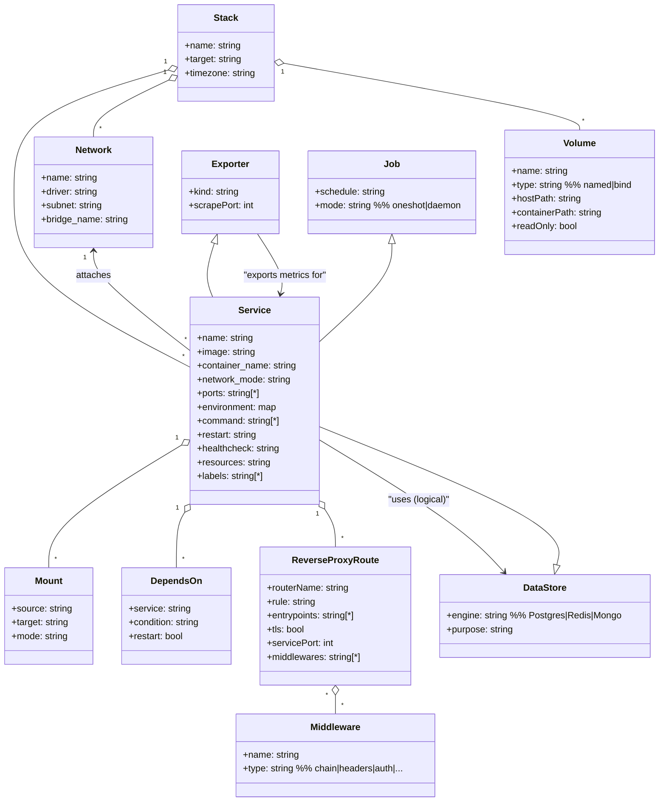
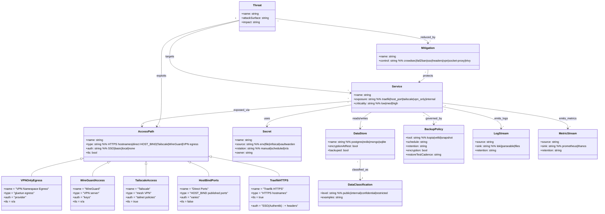

```mermaid
flowchart TB
%% PotatoStack — Logical / Layered Architecture (FULL)

%% ============ EXTERNAL ============
ext[(Users / Clients)]
lan[(LAN)]
inet[(Internet)]
tsClients[(Tailscale Clients)]
wgClients[(WireGuard Peers)]

%% ============ EDGE & ACCESS ============
subgraph EDGE["Edge & Access"]
  traefik[Traefik<br/>Reverse Proxy + ACME + Middlewares]
  crowdsec[CrowdSec<br/>IPS/IDS + Decisions]
  csb[CrowdSec Traefik Bouncer]
  tailscale[Tailscale<br/>(host network)]
  tsHttpsSetup[Tailscale HTTPS Setup<br/>(one-shot)]
  tsHttpsMon[Tailscale HTTPS Monitor]
  wireguard[WireGuard Server]
  fail2ban[Fail2ban<br/>(host network)]
end

%% ============ IDENTITY & SECRETS ============
subgraph IDSEC["Identity & Secrets"]
  authentikS[Authentik Server]
  authentikW[Authentik Worker]
  vaultwarden[Vaultwarden]
  infisical[Infisical]
end

%% ============ CORE DATA STORES ============
subgraph DATA["Core Data Stores"]
  postgres[(PostgreSQL + pgvector)]
  pgbouncer[(PgBouncer)]
  redis[(Redis Cache)]
  mongo[(MongoDB)]
end

%% ============ STORAGE / INIT ============
subgraph STORAGE["Storage & Initialization"]
  storageInit[storage-init<br/>(creates dirs + snapshot env)]
  sharedKeys[(shared-keys volume)]
end

%% ============ FILE SYNC / CLOUD ============
subgraph FILES["Cloud Storage & File Sync"]
  nextcloudAIO[Nextcloud AIO]
  syncthing[Syncthing]
  filebrowser[Filebrowser]
end

%% ============ MEDIA: VPN NAMESPACE ============
subgraph VPNZONE["VPN Namespace (network_mode: service:gluetun)"]
  gluetun[Gluetun<br/>VPN Client + Killswitch]

  %% Arr stack
  prowlarr[Prowlarr]
  sonarr[Sonarr]
  radarr[Radarr]
  lidarr[Lidarr]
  bookshelf[Bookshelf]
  bazarr[Bazarr]

  %% Download clients
  qbittorrent[qBittorrent]
  aria2[Aria2]
  ariang[AriaNg]
  slskd[slskd]
  pinchflat[Pinchflat]
  spotiflac[SpotiFLAC]
end

%% ============ MEDIA SERVERS ============
subgraph MEDIASRV["Media Servers & Requests"]
  jellyfin[Jellyfin]
  jellyseerr[Jellyseerr]
  audiobookshelf[Audiobookshelf]
end

%% ============ KNOWLEDGE / RSS / FINANCE / UTILS ============
subgraph APPS["Apps & Utilities"]
  miniflux[Miniflux]
  actual[Actual Budget]
  rustypaste[Rustypaste]
  linkding[Linkding]
  atuin[Atuin]
  ittools[IT-Tools]
  duckdb[DuckDB (ad-hoc)]
  ntfy[ntfy]
end

%% Optional / disabled apps
subgraph OPTIONAL_APPS["Optional / Disabled (in compose but commented)"]
  adguard[AdGuard Home<br/>(DISABLED)]
  stirling[Stirling-PDF<br/>(DISABLED)]
  paperless[Paperless-ngx<br/>(DISABLED)]
  openwebui[Open WebUI<br/>(DISABLED)]
  maintainerr[Maintainerr<br/>(DISABLED)]
  codeserver[Code-server<br/>(DISABLED)]
  netdata[Netdata<br/>(DISABLED)]
end

%% ============ DEV / CI ============
subgraph DEV["Development & CI/CD"]
  gitea[Gitea]
  giteaRunner[Gitea Runner]
  woodpecker[Woodpecker Server]
  woodpeckerAgent[Woodpecker Agent<br/>(DISABLED in compose)]
end

%% ============ DASHBOARD / DOCKER MGMT ============
subgraph DASH["Dashboard & Container Mgmt"]
  socketProxy[Docker Socket Proxy]
  homarr[Homarr]
end

%% ============ OBSERVABILITY ============
subgraph OBS["Monitoring & Observability"]
  prometheus[Prometheus]
  thanosSidecar[Thanos Sidecar]
  thanosStore[Thanos Store]
  thanosQuery[Thanos Query]
  thanosCompact[Thanos Compactor]
  grafana[Grafana]
  loki[Loki]
  alloy[Grafana Alloy]
  parseable[Parseable]
  uptime[Uptime Kuma]
  scrutiny[Scrutiny]

  cadvisor[cAdvisor]
  nodeExp[Node Exporter]
  pgExp[Postgres Exporter]
  redisExp[Redis Exporter]
  mongoExp[MongoDB Exporter]
  smartExp[Smartctl Exporter]

  alertmanager[Alertmanager]
end

%% ============ AUTOMATION / WORKFLOWS ============
subgraph AUTO["Automation & Workflows"]
  n8n[n8n]
  healthchecks[Healthchecks]
end

%% ============ SECURITY / SUPPLY CHAIN ============
subgraph SECOPS["Security & Supply Chain"]
  trivy[Trivy Server]
  diun[Diun (image update notifier)]
  autoheal[Autoheal]
end

%% ============ BACKUP ============
subgraph BACKUP["Backups"]
  velldApi[Velld API]
  velldWeb[Velld Web]
  kopia[Kopia Server]
  snapshotSched[Snapshot Scheduler (crond)]
end

%% ============ SYSTEM UTILITIES (HOST NET) ============
subgraph SYS["System Utilities (host network)"]
  openssh[OpenSSH Server]
  samba[Samba]
end

%% ============ MONITORS / JOBS ============
subgraph MON["Monitors / Watchdogs (mostly network_mode: none)"]
  gluetunMon[Gluetun Monitor]
  diskMon[Disk Space Monitor]
  traefikLogMon[Traefik Log Monitor]
  backupMon[Backup Monitor]
  dbHealthMon[DB Health Monitor]
  tsConnMon[Tailscale Connectivity Monitor]
  immichLogMon[Immich Log Monitor]
end

%% ============ PHOTO MGMT ============
subgraph PHOTOS["Photo Management"]
  immich[Immich Server]
  immichML[Immich Machine Learning]
end

%% ============ FLOWS: INGRESS ============
ext -->|HTTPS| traefik
lan -->|HTTP/HTTPS| traefik
inet -->|ACME HTTP-01| traefik
tsClients --> tailscale
wgClients --> wireguard

%% Tailscale serve helpers
tsHttpsSetup -. config .-> tailscale
tsHttpsMon --> tailscale

%% CrowdSec at edge
traefik --> csb
csb --> crowdsec
crowdsec -. decisions .- traefik
traefik -->|logs| crowdsec

%% Authentik as SSO provider
traefik -->|forwardAuth / OIDC| authentikS
authentikS --> authentikW

%% Reverse-proxied apps (representative; all “traefik.enable=true”)
traefik --> vaultwarden
traefik --> infisical
traefik --> syncthing
traefik --> filebrowser
traefik --> miniflux
traefik --> actual
traefik --> gitea
traefik --> woodpecker
traefik --> prometheus
traefik --> grafana
traefik --> loki
traefik --> parseable
traefik --> scrutiny
traefik --> uptime
traefik --> ntfy
traefik --> homarr
traefik --> velldApi
traefik --> velldWeb
traefik --> kopia
traefik --> jellyfin
traefik --> jellyseerr
traefik --> audiobookshelf
traefik --> gluetun

%% Optional (if enabled later)
traefik -.-> adguard
traefik -.-> stirling
traefik -.-> paperless
traefik -.-> openwebui
traefik -.-> codeserver
traefik -.-> netdata
traefik -.-> maintainerr

%% ============ DATA FLOWS ============
%% Core DB access
pgbouncer --> postgres

authentikS --> postgres
authentikS --> redis
authentikW --> postgres
authentikW --> redis

miniflux --> postgres
grafana --> postgres
healthchecks --> postgres
n8n --> postgres
n8n --> redis
gitea --> postgres
gitea --> redis
woodpecker --> postgres
infisical --> postgres
infisical --> redis
linkding --> postgres
atuin --> postgres
immich --> postgres
immich --> redis
velldApi -->|stores configs| velldApi
velldApi -->|backups| postgres
velldApi -->|backups| redis
velldApi -->|backups| mongo

%% Mongo usage (stack-level)
mongoExp --> mongo

%% Vaultwarden uses sqlite volume (no DB arrows)
vaultwarden -.-> sharedKeys

%% ============ VPN ZONE INTERNAL ============
prowlarr --> gluetun
sonarr --> gluetun
radarr --> gluetun
lidarr --> gluetun
bookshelf --> gluetun
bazarr --> gluetun
qbittorrent --> gluetun
aria2 --> gluetun
ariang --> gluetun
slskd --> gluetun
pinchflat --> gluetun
spotiflac --> gluetun

%% Typical media automations (logical)
sonarr -->|manages| qbittorrent
radarr -->|manages| qbittorrent
lidarr -->|manages| qbittorrent
bookshelf -->|manages| qbittorrent
prowlarr -->|indexers| sonarr
prowlarr -->|indexers| radarr
prowlarr -->|indexers| lidarr
prowlarr -->|indexers| bookshelf
bazarr -->|subs for| sonarr
bazarr -->|subs for| radarr

jellyseerr -->|requests| jellyfin

%% ============ FILE / CLOUD ============
syncthing --> storageInit
filebrowser --> storageInit
nextcloudAIO --> storageInit

%% ============ PHOTO MGMT ============
immichML --> immich
immich --> storageInit

%% ============ OBSERVABILITY FLOWS ============
%% Metrics
prometheus --> cadvisor
prometheus --> nodeExp
prometheus --> pgExp
prometheus --> redisExp
prometheus --> mongoExp
prometheus --> smartExp
prometheus --> traefik
prometheus --> crowdsec

grafana --> prometheus
grafana --> thanosQuery
grafana --> loki

thanosSidecar --> prometheus
thanosQuery --> thanosSidecar
thanosQuery --> thanosStore
thanosCompact --> thanosStore

%% Logs
alloy --> loki
traefik -->|access log| alloy
crowdsec -->|logs/metrics| prometheus

%% Alerting / notifications (wiring depends on your config)
alertmanager -. alerts .-> ntfy

%% Uptime checks
uptime --> socketProxy

%% ============ SECURITY / SUPPLY CHAIN ============
trivy -->|scans images via docker.sock (ro)| socketProxy
diun -->|checks docker images| socketProxy
autoheal -->|restarts unhealthy| socketProxy

%% ============ DASHBOARD ============
homarr --> postgres
homarr --> redis
homarr --> socketProxy

%% ============ BACKUP ============
snapshotSched --> kopia
kopia --> storageInit
velldWeb --> velldApi

%% ============ SYSTEM UTILITIES ============
openssh --> storageInit
samba --> storageInit

%% ============ MONITORS ============
gluetunMon --> gluetun
traefikLogMon --> traefik
dbHealthMon --> postgres
dbHealthMon --> redis
dbHealthMon --> mongo
backupMon --> kopia
diskMon --> storageInit
tsConnMon --> tailscale
immichLogMon --> immich
```

---

```mermaid
flowchart TB
%% PotatoStack — Network / Trust Boundaries (FULL)

%% External zones
subgraph Z0["Zone 0: External"]
  Users[(Users)]
  Internet[(Internet)]
  LAN[(LAN)]
  TSClients[(Tailscale Clients)]
  WGPeers[(WireGuard Peers)]
end

%% Host boundary
subgraph HOST["Host Boundary (Debian Host)"]
  HostNet[(host network)]
  HostFS[(Host FS: /mnt/storage /mnt/cachehdd /mnt/ssd)]
  DockerSock[(docker.sock)]
  tailscale[Tailscale (host)]
  samba[Samba (host)]
  fail2ban[Fail2ban (host)]
  openssh[OpenSSH (port 2222)]
  wireguard[WireGuard (UDP 51820)]
end

%% Docker bridge boundary
subgraph BR["Docker Boundary: bridge network potatostack (172.22.0.0/16)"]
  traefik[Traefik (80/443)]
  crowdsec[CrowdSec]
  csb[Traefik Bouncer]
  authentikS[Authentik Server]
  authentikW[Authentik Worker]

  postgres[(Postgres)]
  pgbouncer[(PgBouncer)]
  redis[(Redis)]
  mongo[(Mongo)]

  %% Apps on bridge
  nextcloud[Nextcloud AIO]
  syncthing[Syncthing]
  filebrowser[Filebrowser]
  miniflux[Miniflux]
  actual[Actual Budget]
  gitea[Gitea]
  giteaRunner[Gitea Runner]
  woodpecker[Woodpecker]
  homarr[Homarr]
  socketProxy[Socket Proxy]
  ntfy[ntfy]
  jellyfin[Jellyfin]
  jellyseerr[Jellyseerr]
  audiobookshelf[Audiobookshelf]
  immich[Immich]
  immichML[Immich ML]

  %% Observability
  prometheus[Prometheus]
  grafana[Grafana]
  loki[Loki]
  alloy[Alloy]
  parseable[Parseable]
  alertmanager[Alertmanager]
  uptime[Uptime Kuma]
  scrutiny[Scrutiny]
  cadvisor[cAdvisor]
  nodeExp[Node Exporter]
  pgExp[Postgres Exporter]
  redisExp[Redis Exporter]
  mongoExp[Mongo Exporter]
  smartExp[Smartctl Exporter]

  %% Backup
  kopia[Kopia]
  snapshotSched[Snapshot Scheduler]
  velldApi[Velld API]
  velldWeb[Velld Web]

  %% Automation/SecOps
  n8n[n8n]
  healthchecks[Healthchecks]
  trivy[Trivy]
  diun[Diun]
  autoheal[Autoheal]

  %% Utilities
  rustypaste[Rustypaste]
  linkding[Linkding]
  atuin[Atuin]
  ittools[IT-Tools]
  duckdb[DuckDB]
end

%% VPN namespace boundary
subgraph VPNNS["VPN Namespace Boundary (network_mode: service:gluetun)"]
  gluetun[Gluetun VPN + Firewall/Killswitch]
  prowlarr[Prowlarr]
  sonarr[Sonarr]
  radarr[Radarr]
  lidarr[Lidarr]
  bookshelf[Bookshelf]
  bazarr[Bazarr]
  qb[qBittorrent]
  aria2[Aria2]
  ariang[AriaNg]
  slskd[slskd]
  pinchflat[Pinchflat]
  spotiflac[SpotiFLAC]
end

%% No-network jobs
subgraph NONET["No-Network / Job Containers (network_mode: none)"]
  storageInit[storage-init]
  tsHttpsSetup[Tailscale HTTPS Setup]
  tsHttpsMon[Tailscale HTTPS Monitor]
  gluetunMon[Gluetun Monitor]
  dbHealthMon[DB Health Monitor]
  diskMon[Disk Space Monitor]
  traefikLogMon[Traefik Log Monitor]
  backupMon[Backup Monitor]
  tsConnMon[Tailscale Connectivity Monitor]
  immichLogMon[Immich Log Monitor]
end

%% Ingress paths
Users -->|HTTPS| traefik
LAN -->|HTTPS| traefik
Internet -->|ACME HTTP-01| traefik

TSClients --> tailscale
WGPeers --> wireguard

%% Host-exposed ports (you publish many HOST_BIND ports)
LAN -->|direct HOST_BIND ports| HostNet
TSClients -->|direct access via TS routes| HostNet

%% Trust relationships
traefik --> csb --> crowdsec
traefik --> authentikS
authentikS --> authentikW

%% Data plane: apps -> datastores
authentikS --> postgres
authentikS --> redis
authentikW --> postgres
authentikW --> redis

miniflux --> postgres
actual --> HostFS
gitea --> postgres
gitea --> redis
woodpecker --> postgres
n8n --> postgres
n8n --> redis
healthchecks --> postgres
homarr --> postgres
homarr --> redis
immich --> postgres
immich --> redis
immichML --> immich

%% Observability plane
prometheus --> nodeExp
prometheus --> cadvisor
prometheus --> pgExp
prometheus --> redisExp
prometheus --> mongoExp
prometheus --> smartExp
grafana --> prometheus
alloy --> loki
grafana --> loki
alertmanager -.notify.-> ntfy
uptime --> socketProxy

%% Docker API trust (reduced by socket-proxy where used)
socketProxy --> DockerSock
diun --> DockerSock
autoheal --> DockerSock
trivy --> DockerSock
uptime --> DockerSock

%% VPN namespace: all share gluetun network
prowlarr --> gluetun
sonarr --> gluetun
radarr --> gluetun
lidarr --> gluetun
bookshelf --> gluetun
bazarr --> gluetun
qb --> gluetun
aria2 --> gluetun
ariang --> gluetun
slskd --> gluetun
pinchflat --> gluetun
spotiflac --> gluetun

gluetun -->|VPN egress only| Internet

%% No-network jobs mounting host resources
storageInit --> HostFS
dbHealthMon --> DockerSock
gluetunMon --> DockerSock
traefikLogMon --> DockerSock
backupMon --> HostFS
diskMon --> HostFS
tsConnMon --> DockerSock
immichLogMon --> DockerSock
tsHttpsSetup --> DockerSock
tsHttpsMon --> DockerSock

%% Backup plane
kopia --> HostFS
snapshotSched --> DockerSock
velldApi --> HostFS
velldWeb --> velldApi
```

---



---


