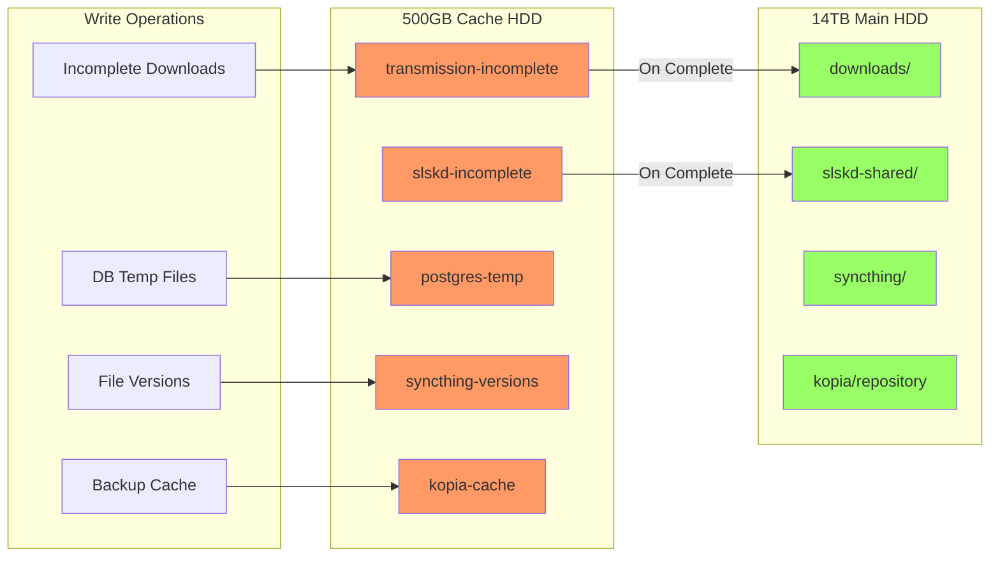
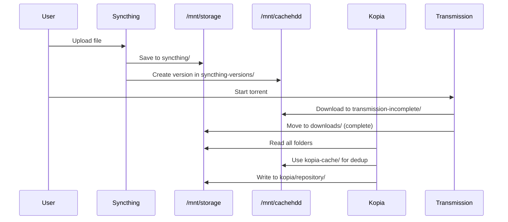

# PotatoStack Light

**Ultra-lean Docker stack for Le Potato (2GB RAM)**

VPN-protected P2P, OneDrive sync, backups, password manager. Dual-disk caching. ~1.2GB total RAM usage.

## Architecture

```mermaid
graph TB
    subgraph Internet
        VPN[VPN Gateway]
    end

    subgraph "Gluetun VPN Container"
        GLU[Gluetun Killswitch]
        TRANS[Transmission]
        SLSK[slskd]
    end

    subgraph "Core Services"
        HOME[Homepage Dashboard]
        SYNC[Syncthing]
        FILE[FileBrowser]
        VAULT[Vaultwarden]
        PORT[Portainer]
        KOPIA[Kopia Backup]
    end

    subgraph "Infrastructure"
        WATCH[Watchtower]
        HEAL[Autoheal]
    end

    subgraph "Storage - 14TB HDD"
        STOR[/mnt/storage<br/>Final Storage]
    end

    subgraph "Cache - 500GB HDD"
        CACHE[/mnt/cachehdd<br/>Temp & Cache]
    end

    VPN --> GLU
    GLU --> TRANS
    GLU --> SLSK

    TRANS --> CACHE
    SLSK --> CACHE
    SYNC --> CACHE
    KOPIA --> CACHE
    PG --> CACHE

    TRANS --> STOR
    SLSK --> STOR
    SYNC --> STOR
    KOPIA --> STOR
    FILE --> STOR
    FILE --> CACHE

    HOME -.-> TRANS
    HOME -.-> SLSK
    HOME -.-> SYNC
    HOME -.-> KOPIA
    HOME -.-> VAULT
```

## Storage Strategy



## Quick Start

```bash
# 1. Mount drives
sudo mkdir -p /mnt/storage /mnt/cachehdd
# Edit /etc/fstab with your UUIDs
sudo mount -a

# 2. Run setup
cd light
cp .env.example .env
# Edit .env with your credentials
./quick-start.sh

# 3. Access services at http://YOUR_IP:PORT
```

## Services & Ports

| Service | Port | Description |
|---------|------|-------------|
| Homepage | 3000 | Unified dashboard |
| Gluetun | 8000 | VPN control panel |
| Transmission | 9091 | Torrent client (via VPN) |
| slskd | 2234 | Soulseek client (via VPN) |
| Syncthing | 8384 | P2P file sync |
| FileBrowser | 8181 | Web file manager |
| RustyPaste | 8787 | File sharing & pastebin |
| Vaultwarden | 8443 | Password manager (HTTPS) |
| Portainer | 9443 | Container management |
| Kopia | 51515 | Backup server |
| Aria2 | 6800 | RPC endpoint (via VPN) |
| AriaNg | 6880 | Aria2 Web UI |
| Samba | 445 | Network file share (SMB) |

## Complete Folder Structure

```
/mnt/storage/                         # 14TB Main Storage
├── downloads/                        # Completed torrents
├── slskd-shared/                     # Soulseek shared files
├── rustypaste/                       # File sharing uploads
├── syncthing/                        # Syncthing sync folders
│   ├── Desktop/
│   ├── Obsidian-Vault/
│   ├── Bilder/
│   ├── Dokumente/
│   ├── workdir/
│   ├── nvim/
│   ├── Microsoft-Copilot-Chat-Dateien/
│   ├── Attachments/
│   ├── Privates/
│   ├── Studium/
│   ├── Berufliches/
│   ├── camera-sync/
│   │   ├── android/
│   │   └── ios/
│   ├── photos/
│   │   ├── 2024/
│   │   ├── 2025/
│   │   └── albums/
│   ├── videos/
│   │   ├── personal/
│   │   ├── projects/
│   │   └── raw/
│   ├── music/
│   │   ├── albums/
│   │   └── playlists/
│   ├── audiobooks/
│   ├── podcasts/
│   ├── books/
│   ├── shared/
│   └── backup/
└── kopia/
    └── repository/                   # Backup repository

/mnt/cachehdd/                        # 500GB Cache HDD
├── transmission-incomplete/          # Active torrents
├── slskd-incomplete/                 # Active downloads
├── kopia-cache/                      # Dedup cache
└── syncthing-versions/               # File versioning

Docker Volumes:
├── gluetun-config
├── transmission-config
├── transmission-watch
├── slskd-config
├── slskd-logs
├── syncthing-config
├── filebrowser-config
├── filebrowser-database
├── postgres-data
├── redis-data
├── vaultwarden-data
├── portainer-data
├── kopia-config
└── kopia-logs
```

## Data Flow



## Configuration

Edit `.env` before starting:

```bash
# Network
HOST_BIND=192.168.178.40
LAN_NETWORK=192.168.178.0/24

# VPN (Surfshark credentials)
SURFSHARK_USER=your_username
SURFSHARK_PASSWORD=your_password

# Service Passwords
TRANSMISSION_PASSWORD=...
SLSKD_PASSWORD=...
VAULTWARDEN_ADMIN_TOKEN=...
KOPIA_PASSWORD=...

# Get from UIs after first start:
SYNCTHING_API_KEY=
SLSKD_API_KEY=
```

**Optional Portainer:**
```bash
# Start with Portainer (container management UI)
docker compose --profile optional up -d

# Start without Portainer (save 96MB RAM)
docker compose up -d
```

## Memory Optimizations

**Removed unused services:**
- PostgreSQL ❌ (saved 384MB)
- Redis ❌ (saved 128MB)

**Resource limits (total ~1.2GB):**
- Homepage: 96MB
- Gluetun: 96MB
- Transmission: minimal
- slskd: minimal
- Syncthing: 384MB
- Kopia: 192MB
- Vaultwarden: 96MB
- FileBrowser: 96MB
- Portainer: 96MB (optional profile)
- Watchtower: 48MB
- Autoheal: 24MB

**Logging:**
- 5MB max size, 2 files, compressed
- Reduced verbosity across all services

**Other:**
- Swap: 4GB file (swappiness=10)
- ZRAM: ~1GB compressed RAM
- Healthchecks: 60-120s intervals
- Restart policy: `unless-stopped`

## Backup Strategy

**Kopia Server** backs up:
- All Syncthing folders (OneDrive mirror + media)
- Vaultwarden passwords
- Downloads & slskd files

**Connect from any device:**
```bash
kopia repository connect server --url https://YOUR_IP:51515
kopia snapshot create ~/Documents
```

## Commands

```bash
# Start stack
docker compose up -d

# View logs
docker compose logs -f [service]

# Restart service
docker compose restart [service]

# Check status
docker compose ps

# Stop stack
docker compose down

# Check memory
free -h && docker stats --no-stream
```

## Automated Tasks

| Task | Schedule | Action |
|------|----------|--------|
| Watchtower | 3 AM daily | Update containers |
| Autoheal | Every 30s | Restart unhealthy containers |
| Backup | 3 AM daily | Rsync to backup drive |
| Cleanup | Sunday 4 AM | Prune unused images |

## Troubleshooting

**High Memory:**
```bash
free -h
docker stats --no-stream
tail /var/log/memory-pressure.log
```

**VPN not working:**
```bash
docker compose logs gluetun
curl http://YOUR_IP:8000/v1/publicip/ip
```

**Permission errors:**
```bash
sudo chown -R 1000:1000 /mnt/storage /mnt/cachehdd
docker compose restart
```

## Security

- Services bind to LAN IP only
- VPN killswitch for P2P traffic
- Passwords auto-generated
- File versioning enabled
- Nightly backups
