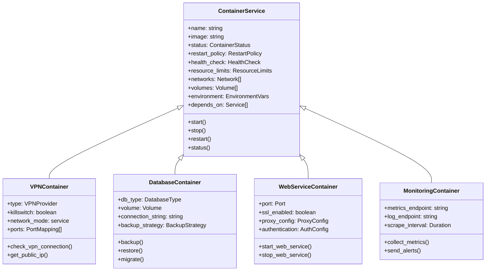
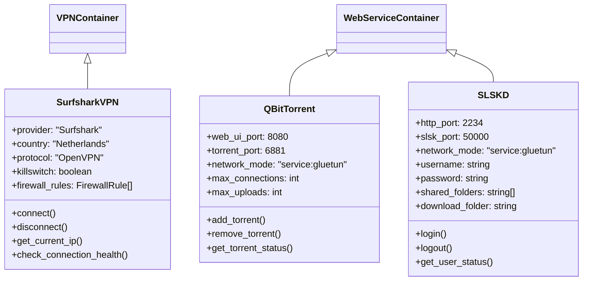
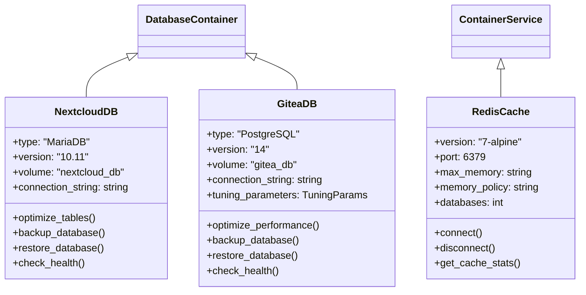
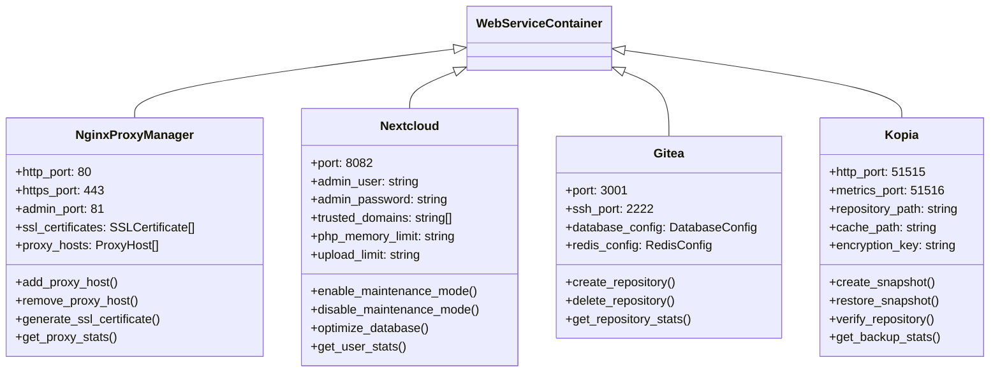
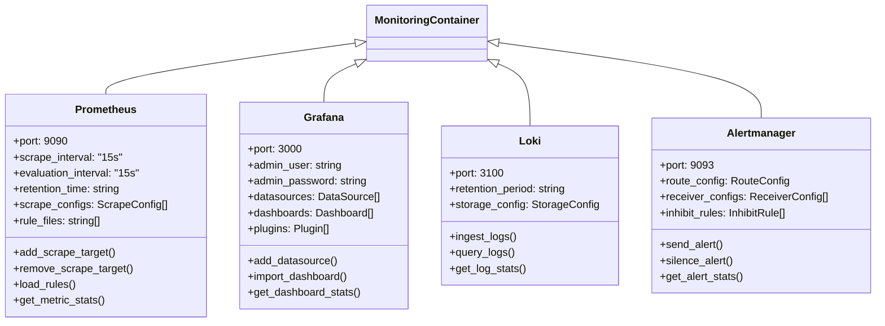
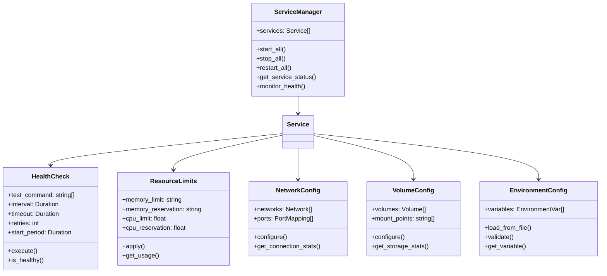
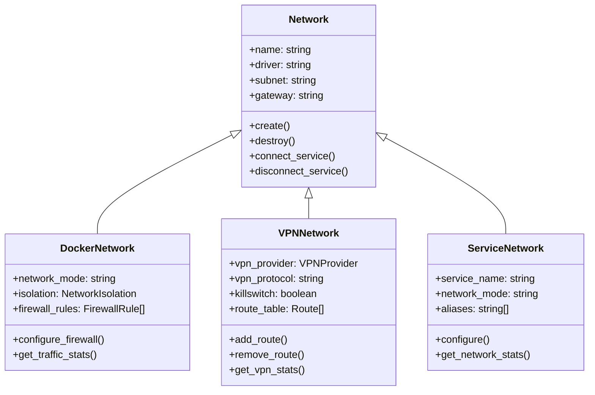
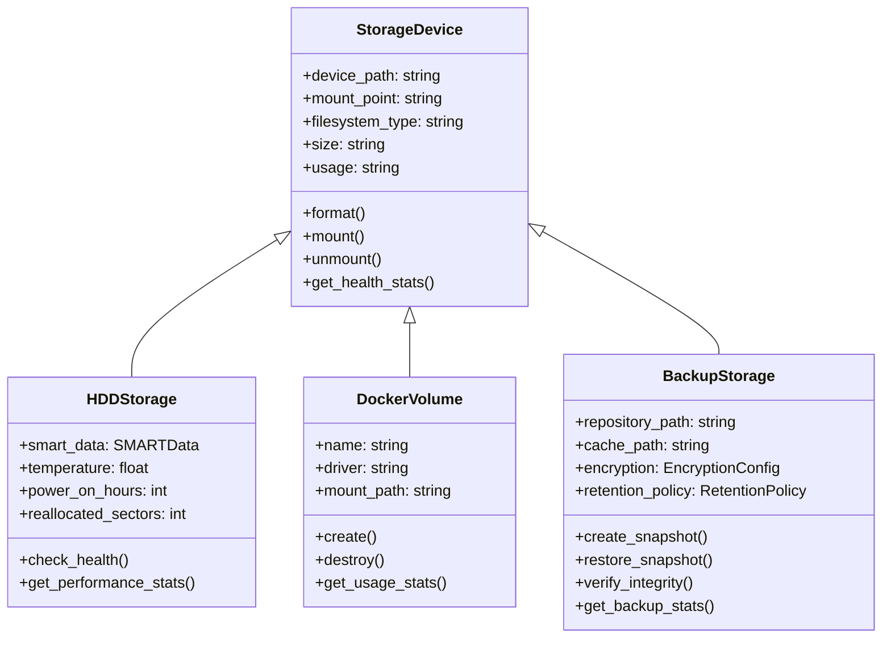
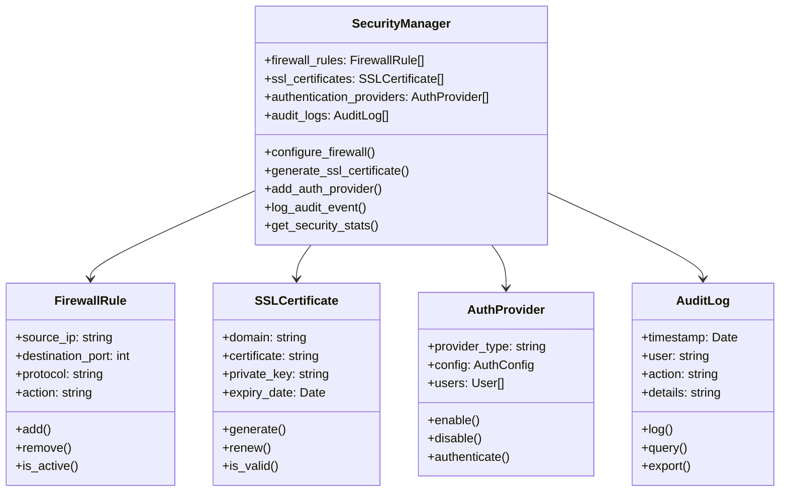
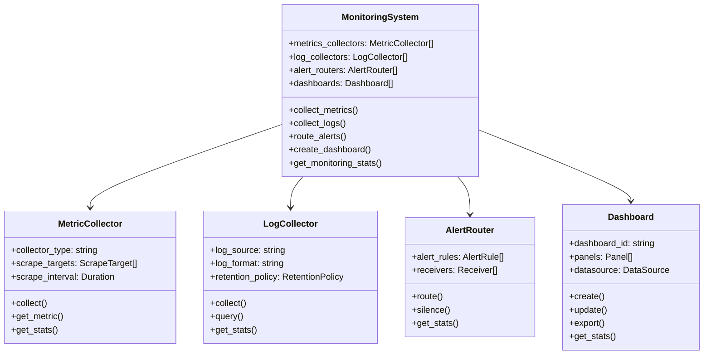

# PotatoStack Class Diagrams

## Table of Contents
1. [Container Service Class Diagram](#container-service-class-diagram)
2. [VPN Container Class Diagram](#vpn-container-class-diagram)
3. [Database Container Class Diagram](#database-container-class-diagram)
4. [Web Service Container Class Diagram](#web-service-container-class-diagram)
5. [Monitoring Container Class Diagram](#monitoring-container-class-diagram)
6. [Service Implementation Classes](#service-implementation-classes)
7. [Network Architecture Classes](#network-architecture-classes)
8. [Storage Architecture Classes](#storage-architecture-classes)
9. [Security Architecture Classes](#security-architecture-classes)
10. [Monitoring Architecture Classes](#monitoring-architecture-classes)

---

## Container Service Class Diagram

---

## VPN Container Class Diagram

---

## Database Container Class Diagram

---

## Web Service Container Class Diagram

---

## Monitoring Container Class Diagram

---

## Service Implementation Classes

---

## Network Architecture Classes

---

## Storage Architecture Classes

---

## Security Architecture Classes

---

## Monitoring Architecture Classes

---

**Document Version**: 2.0
**Last Updated**: December 2025
**Classification**: Internal Use
**Review Cycle**: Quarterly