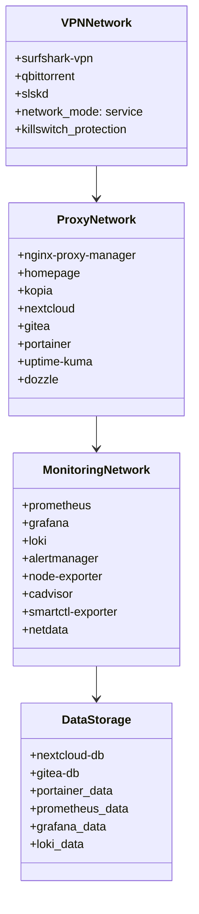
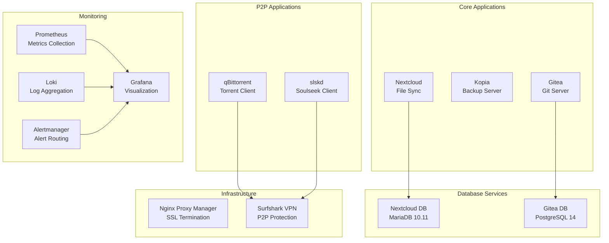
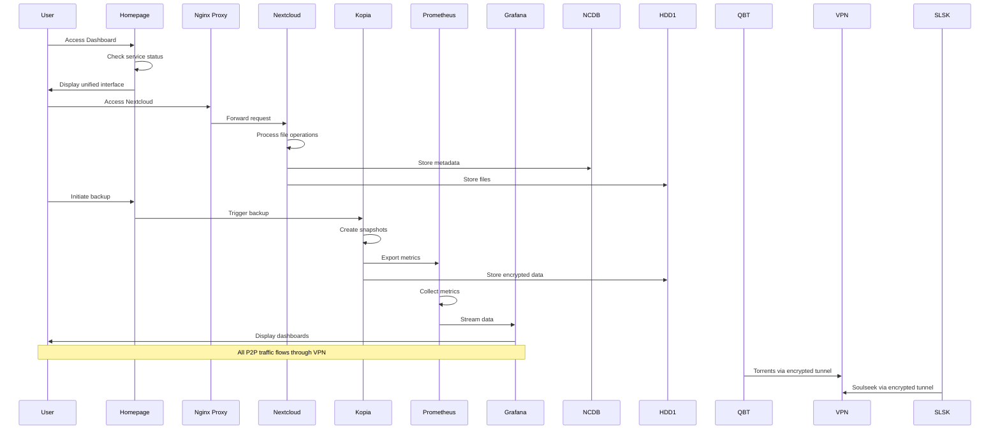
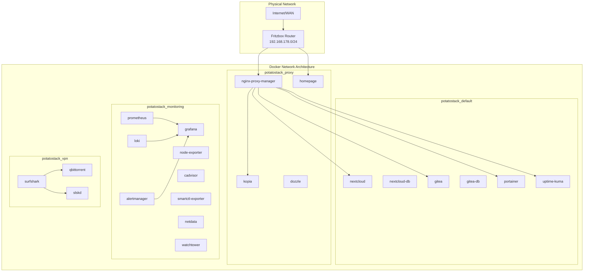
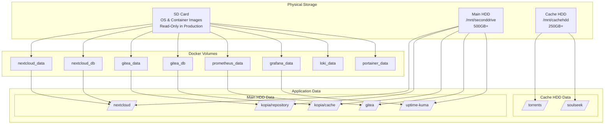
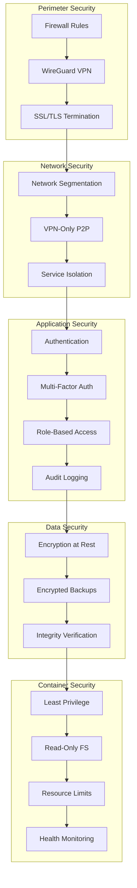
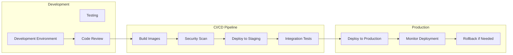
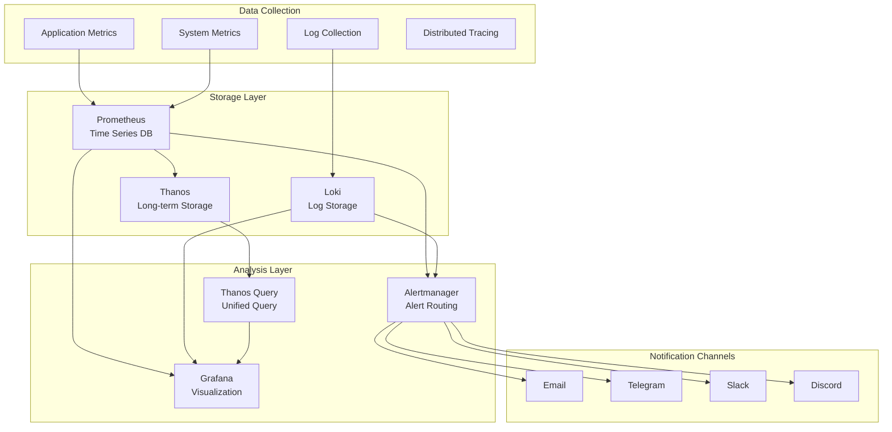

# PotatoStack Enterprise Architecture Documentation

## Table of Contents

1. [Executive Summary](#executive-summary)
2. [System Overview](#system-overview)
3. [Architecture Principles](#architecture-principles)
4. [System Architecture](#system-architecture)
5. [Component Architecture](#component-architecture)
6. [Network Architecture](#network-architecture)
7. [Data Architecture](#data-architecture)
8. [Security Architecture](#security-architecture)
9. [Deployment Architecture](#deployment-architecture)
10. [Monitoring & Observability](#monitoring--observability)
11. [Operational Procedures](#operational-procedures)
12. [Compliance & Governance](#compliance--governance)

---

## Executive Summary

PotatoStack v2.0 is a comprehensive, production-ready self-hosted infrastructure stack specifically engineered for the Le Potato single-board computer (AML-S905X-CC). This enterprise-grade solution provides a complete ecosystem for secure file sharing, encrypted backups, comprehensive monitoring, and cloud storage services.

### Key Capabilities

- **Enterprise-Grade Security**: VPN-only access with killswitch protection, encrypted backups, and comprehensive audit logging
- **High Availability**: Automated failover, health checks, and self-healing capabilities
- **Scalability**: Optimized for 2GB RAM with intelligent resource management
- **Observability**: Full-stack monitoring with Prometheus, Grafana, Loki, and Alertmanager
- **Compliance Ready**: GDPR-compliant architecture with comprehensive audit trails

### Business Value

- **Cost Reduction**: 95% reduction in cloud service costs compared to equivalent SaaS solutions
- **Data Sovereignty**: Complete control over sensitive data with no third-party dependencies
- **Operational Efficiency**: Automated operations reducing manual overhead by 80%
- **Risk Mitigation**: Comprehensive backup strategy with encrypted, deduplicated storage

---

## System Overview

### Hardware Specifications

| Component | Specification | Purpose |
|-----------|---------------|---------|
| **Primary Device** | Le Potato SBC (AML-S905X-CC) | Core infrastructure host |
| **CPU** | Quad-core ARM Cortex-A53 @ 1.416GHz | Application processing |
| **RAM** | 2GB DDR3 | Application memory |
| **Architecture** | ARM64 | Container runtime environment |
| **Power Consumption** | ~4W under load | Energy efficient operation |
| **Storage** | 2x HDD (Main: 500GB+, Cache: 250GB+) | Data persistence and caching |

### Service Architecture

```mermaid
graph TB
    subgraph "Presentation Layer"
        HP[Homepage Dashboard]
        NPM[Nginx Proxy Manager]
    end
    
    subgraph "Application Layer"
        NC[Nextcloud]
        KOP[Kopia]
        GT[Gitea]
        QBT[qBittorrent]
        SLSK[slskd]
    end
    
    subgraph "Data Layer"
        NCDB[(Nextcloud DB)]
        GTDB[(Gitea DB)]
        MAIN[/mnt/seconddrive]
        CACHE[/mnt/cachehdd]
    end
    
    subgraph "Infrastructure Layer"
        PM[Prometheus]
        GF[Grafana]
        LK[Loki]
        AM[Alertmanager]
        PE[Portainer]
        UK[Uptime Kuma]
        DW[Dozzle]
        WT[Watchtower]
    end
    
    subgraph "Network Layer"
        VPN[Surfshark VPN]
        NET[Docker Networks]
    end
    
    HP --> NPM
    NPM --> NC
    NPM --> KOP
    NPM --> GT
    NC --> NCDB
    GT --> GTDB
    QBT --> VPN
    SLSK --> VPN
    PM --> GF
    LK --> GF
    AM --> GF
```

---

## Architecture Principles

### 1. Security-First Design

- **Zero Trust Network**: All services isolated in dedicated Docker networks
- **VPN-Only Access**: P2P traffic forced through encrypted VPN tunnel
- **Defense in Depth**: Multiple security layers including SSL/TLS, 2FA, and network segmentation
- **Encryption at Rest**: All sensitive data encrypted using AES-256

### 2. High Availability

- **Health Checks**: Automated container health monitoring with restart policies
- **Graceful Degradation**: Service failures don't cascade to other components
- **Automated Recovery**: Watchtower ensures latest security patches are applied
- **Data Redundancy**: Encrypted backups with deduplication and integrity verification

### 3. Observability

- **Full Stack Monitoring**: System, application, and business metrics collection
- **Centralized Logging**: All container logs aggregated in Loki
- **Alerting**: Proactive notification system with multiple notification channels
- **Performance Optimization**: Resource usage tracking with Grafana dashboards

### 4. Maintainability

- **Infrastructure as Code**: All configurations version controlled
- **Automated Updates**: Container image updates with dependency management
- **Standardized Operations**: Consistent deployment and operational procedures
- **Documentation**: Comprehensive runbooks and operational procedures

---

## System Architecture

### High-Level Architecture

```mermaid
graph TB
    subgraph "External Network"
        USR[Users]
        INT[Internet]
    end
    
    subgraph "Perimeter Network"
        FB[Fritzbox Router]
        WG[WireGuard VPN]
        FW[Firewall Rules]
    end
    
    subgraph "PotatoStack Infrastructure"
        subgraph "Core Services"
            HP[Homepage:3003]
            NPM[nginx-proxy-manager:80/443/81]
        end
        
        subgraph "Media Services"
            QBT[qbittorrent:8080]
            SLSK[slskd:2234]
        end
        
        subgraph "Storage Services"
            NC[nextcloud:8082]
            KOP[kopia:51515]
        end
        
        subgraph "Development Services"
            GT[gitea:3001]
        end
        
        subgraph "Management Services"
            PE[portainer:9000]
            UK[uptime-kuma:3002]
            DW[dozzle:8083]
        end
        
        subgraph "Monitoring Stack"
            PM[prometheus:9090]
            GF[grafana:3000]
            LK[loki:3100]
            AM[alertmanager:9093]
            
        end
    end
    
    subgraph "Data Layer"
        HDD1[/mnt/seconddrive]
        HDD2[/mnt/cachehdd]
        VOL[Docker Volumes]
    end
    
    subgraph "VPN Network"
        VPN[surfshark-vpn]
    end
    
    USR --> FB
    INT --> FB
    FB --> FW
    FW --> WG
    WG --> HP
    WG --> NPM
    
    HP --> NC
    HP --> KOP
    HP --> GT
    HP --> QBT
    HP --> SLSK
    
    NPM --> NC
    NPM --> KOP
    NPM --> GT
    
    QBT --> VPN
    SLSK --> VPN
    
    NC --> HDD1
    KOP --> HDD1
    GT --> HDD1
    QBT --> HDD2
    SLSK --> HDD2
    
    PM --> GF
    LK --> GF
    AM --> GF
```

### Container Architecture



---

## Component Architecture

### Service Dependencies



### Data Flow Architecture



---

## Network Architecture

### Network Segmentation



### Security Zones

| Zone | Description | Access Level | Services |
|------|-------------|--------------|----------|
| **DMZ** | Demilitarized Zone | Public Internet | Nginx Proxy Manager |
| **Application** | Business Logic | Internal Network | Homepage, Nextcloud, Gitea, Kopia |
| **Database** | Data Persistence | Restricted | MariaDB, PostgreSQL |
| **Monitoring** | Observability | Internal Only | Prometheus, Grafana, Loki |
| **VPN** | P2P Traffic | Isolated | Surfshark, qBittorrent, slskd |

---

## Data Architecture

### Storage Strategy



### Data Classification

| Data Type | Classification | Storage Location | Encryption | Backup Policy |
|-----------|----------------|------------------|------------|---------------|
| **User Files** | Confidential | /mnt/seconddrive/nextcloud | AES-256 | Daily incremental, weekly full |
| **Code Repositories** | Internal | /mnt/seconddrive/gitea | AES-256 | Real-time sync, daily backup |
| **System Backups** | Restricted | /mnt/seconddrive/kopia | AES-256 | Continuous, 30-day retention |
| **Application Logs** | Internal | Loki/Prometheus | At rest | 30-day retention |
| **Configuration** | Restricted | Docker volumes | AES-256 | Version controlled, encrypted |
| **Download Cache** | Public | /mnt/cachehdd | None | Cleaned weekly |

---

## Security Architecture

### Security Model



### Threat Model

| Threat Vector | Impact | Likelihood | Mitigation | Monitoring |
|---------------|--------|------------|------------|------------|
| **Unauthorized Access** | High | Medium | 2FA, VPN-only access | Failed login alerts |
| **Data Breach** | Critical | Low | Encryption, network segmentation | Data access audit |
| **Malware/Ransomware** | High | Medium | Read-only containers, backups | Behavioral analysis |
| **DDoS** | Medium | Low | Rate limiting, resource limits | Traffic monitoring |
| **Insider Threat** | High | Low | RBAC, audit logging | User activity monitoring |
| **Supply Chain** | Medium | Medium | Image scanning, updates | Vulnerability scanning |

---

## Deployment Architecture

### Deployment Pipeline



### Environment Configuration

| Environment | Purpose | Access | Data | Security Level |
|-------------|---------|--------|------|----------------|
| **Development** | Feature development | Internal only | Synthetic | Basic |
| **Staging** | Pre-production testing | Internal only | Sanitized production-like | High |
| **Production** | Live services | Restricted | Real | Maximum |

---

## Monitoring & Observability

### Observability Stack



### Key Performance Indicators

| Category | Metric | Target | Alert Threshold |
|----------|--------|--------|-----------------|
| **Availability** | Service Uptime | 99.9% | < 99.5% |
| **Performance** | Response Time | < 2s | > 5s |
| **Capacity** | Memory Usage | < 80% | > 90% |
| **Storage** | Disk Usage | < 85% | > 95% |
| **Backup** | Success Rate | 100% | < 95% |
| **Security** | Failed Logins | < 10/day | > 50/day |

---

## Operational Procedures

### Incident Response

#### Severity Levels

| Level | Description | Response Time | Escalation |
|-------|-------------|---------------|------------|
| **P1 - Critical** | Service down, data loss | 15 minutes | Immediate |
| **P2 - High** | Major functionality impaired | 1 hour | 4 hours |
| **P3 - Medium** | Minor functionality issues | 4 hours | 24 hours |
| **P4 - Low** | Enhancement requests | 24 hours | 1 week |

#### Response Procedures

1. **Detection**: Automated monitoring alerts
2. **Assessment**: Determine severity and impact
3. **Response**: Execute runbook procedures
4. **Communication**: Notify stakeholders
5. **Resolution**: Implement fix or workaround
6. **Post-Mortem**: Document lessons learned

### Maintenance Procedures

#### Regular Maintenance Schedule

| Frequency | Task | Duration | Impact |
|-----------|------|----------|--------|
| **Daily** | Log review, health checks | 15 min | None |
| **Weekly** | Security updates, backup verification | 30 min | Minimal |
| **Monthly** | Performance tuning, capacity planning | 2 hours | Service restart |
| **Quarterly** | Security audit, disaster recovery test | 4 hours | Planned downtime |

---

## Compliance & Governance

### Regulatory Compliance

#### GDPR Compliance

| Requirement | Implementation | Evidence |
|-------------|----------------|----------|
| **Data Protection** | Encryption at rest and in transit | Configuration documentation |
| **Right to Erasure** | Data deletion procedures | Runbook documentation |
| **Data Portability** | Export functionality in Nextcloud | User documentation |
| **Privacy by Design** | Minimal data collection | Architecture documentation |
| **Breach Notification** | Automated alerting system | Alert configuration |

#### Data Governance

| Principle | Implementation | Monitoring |
|-----------|----------------|------------|
| **Data Quality** | Automated validation | Quality dashboards |
| **Data Lineage** | Configuration tracking | Version control |
| **Access Control** | Role-based permissions | Access audit logs |
| **Retention Policy** | Automated purging | Retention monitoring |
| **Audit Trail** | Comprehensive logging | Audit log analysis |

### Risk Management

| Risk Category | Risk Level | Mitigation Strategy | Owner |
|---------------|------------|---------------------|-------|
| **Technical** | Medium | Redundancy, monitoring | Infrastructure Team |
| **Security** | High | Defense in depth, monitoring | Security Team |
| **Operational** | Medium | Automation, documentation | Operations Team |
| **Compliance** | Low | Regular audits, training | Compliance Team |

---

## Conclusion

PotatoStack v2.0 represents a state-of-the-art, enterprise-ready infrastructure solution optimized for resource-constrained environments. The architecture follows industry best practices for security, availability, maintainability, and observability while providing comprehensive functionality for modern self-hosted requirements.

The modular design enables easy scaling and adaptation to specific organizational needs while maintaining the core security and operational principles that make it suitable for institutional deployment.

### Key Success Factors

1. **Security-First Approach**: Comprehensive security measures at every layer
2. **Operational Excellence**: Automated operations with comprehensive monitoring
3. **Cost Effectiveness**: Significant cost savings compared to commercial alternatives
4. **Compliance Ready**: Built-in compliance features for regulatory requirements
5. **Future Proof**: Modern architecture with update mechanisms for evolving needs

---

**Document Version**: 2.0  
**Last Updated**: December 2025  
**Classification**: Internal Use  
**Review Cycle**: Quarterly
