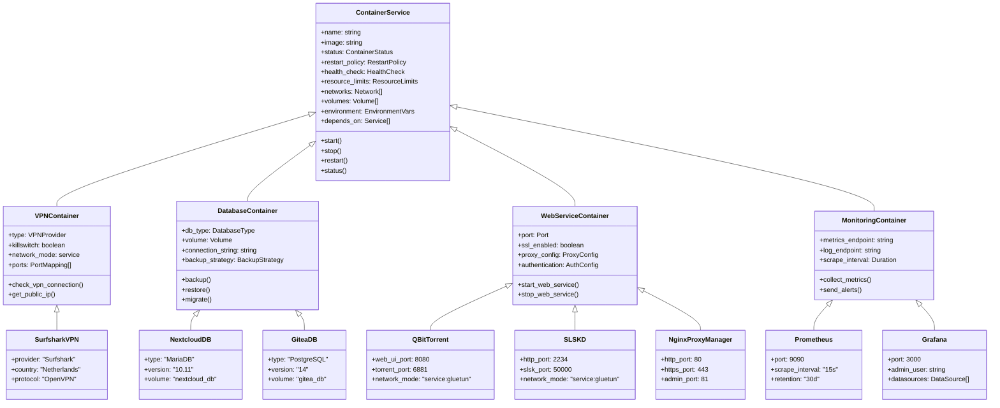
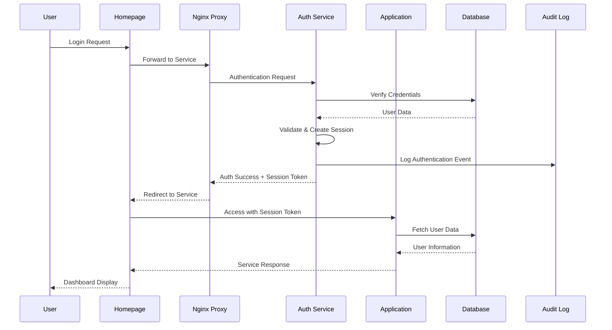
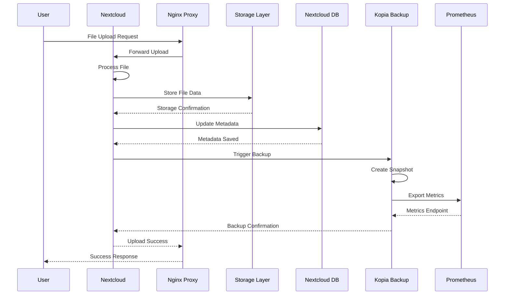
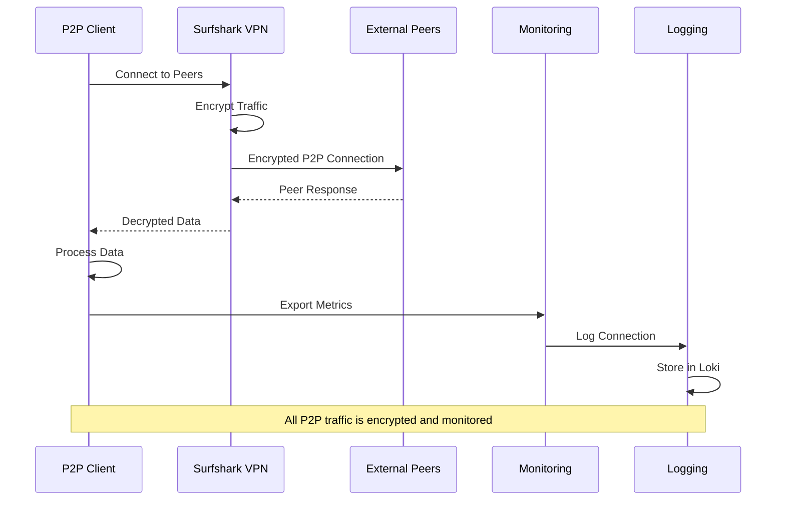
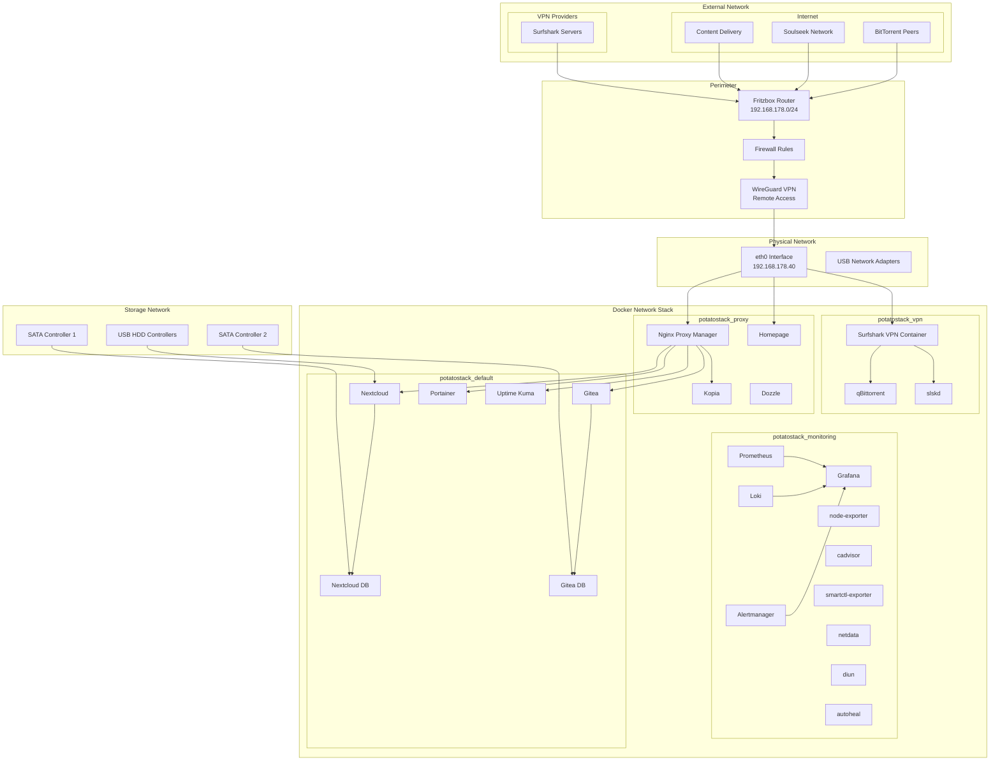
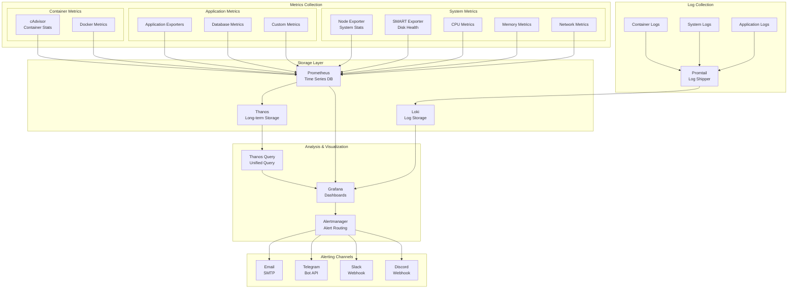
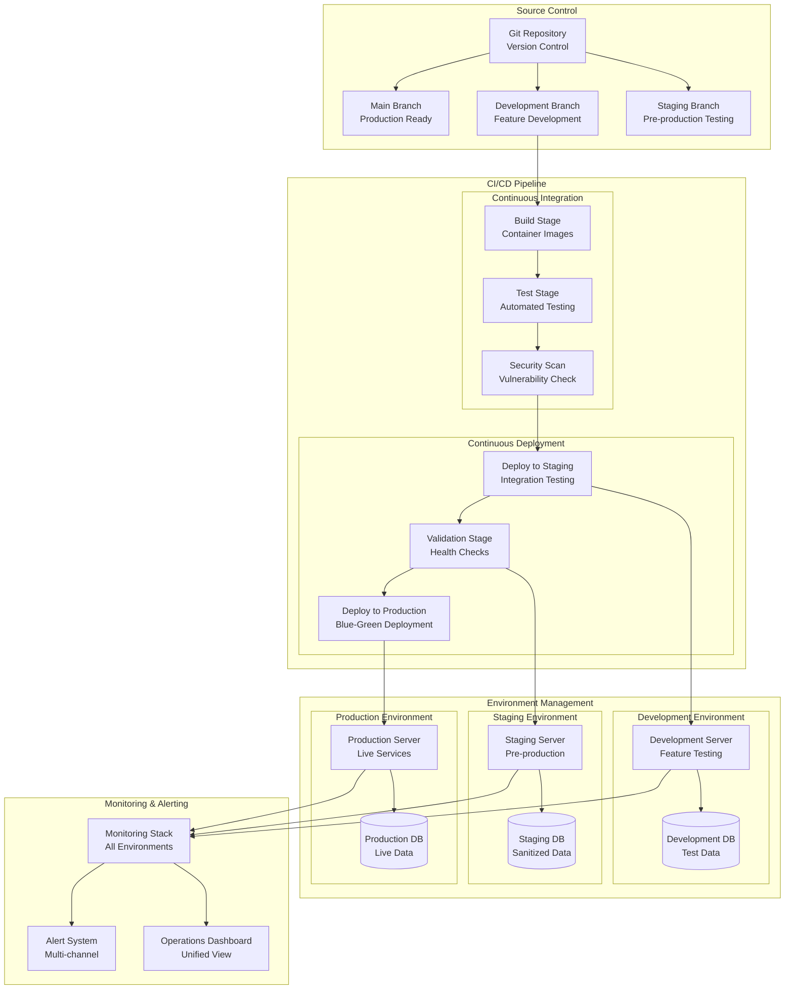

# PotatoStack System Component Diagrams

## Table of Contents

1. [Service Component Model](#service-component-model)
2. [Container Architecture](#container-architecture)
3. [Data Flow Diagrams](#data-flow-diagrams)
4. [Network Topology](#network-topology)
5. [Security Layer Architecture](#security-layer-architecture)
6. [Monitoring Stack](#monitoring-stack)
7. [Storage Architecture](#storage-architecture)
8. [Deployment Architecture](#deployment-architecture)

---

## Service Component Model

### Core Services Component Diagram

```mermaid
graph TB
    subgraph "User Interface Layer"
        UI[Homepage Dashboard]
        WEB[Web Interfaces]
    end
    
    subgraph "Application Services"
        subgraph "Media & Communication"
            QBT[qBittorrent<br/>Torrent Client]
            SLSK[slskd<br/>Soulseek Client]
        end
        
        subgraph "Data Management"
            NC[Nextcloud<br/>File Sync]
            KOP[Kopia<br/>Backup System]
        end
        
        subgraph "Development"
            GT[Gitea<br/>Git Server]
        end
        
        subgraph "Management"
            PE[Portainer<br/>Container Mgmt]
            UK[Uptime Kuma<br/>Monitoring]
            DW[Dozzle<br/>Log Viewer]
        end
    end
    
    subgraph "Infrastructure Services"
        subgraph "Proxy & Load Balancing"
            NPM[Nginx Proxy Manager<br/>SSL Termination]
        end
        
        subgraph "VPN & Security"
            VPN[Surfshark VPN<br/>P2P Protection]
        end
    end
    
    subgraph "Data Services"
        subgraph "Databases"
            NCDB[(Nextcloud DB<br/>MariaDB)]
            GTDB[(Gitea DB<br/>PostgreSQL)]
        end
        
        subgraph "Storage"
            HDD1[/mnt/seconddrive]
            HDD2[/mnt/cachehdd]
            VOL[Docker Volumes]
        end
    end
    
    subgraph "System Services"
        DN[Diun<br/>Update Notifications]
        AH[Autoheal<br/>Restart Unhealthy]
    end
    
    UI --> NPM
    UI --> WEB
    
    NPM --> NC
    NPM --> KOP
    NPM --> GT
    NPM --> PE
    NPM --> UK
    NPM --> DW
    
    QBT --> VPN
    SLSK --> VPN
    
    NC --> NCDB
    NC --> HDD1
    KOP --> HDD1
    GT --> GTDB
    GT --> HDD1
    
    QBT --> HDD2
    SLSK --> HDD2
    
    WT --> PE
```

---

## Container Architecture

### Container Relationship Diagram



---

## Data Flow Diagrams

### User Authentication Flow



### File Upload Flow



### P2P Traffic Flow



---

## Network Topology

### Detailed Network Architecture



---

## Security Layer Architecture

### Security Component Model

```mermaid
graph TB
    subgraph "Network Security"
        subgraph "Perimeter Security"
            FW[Firewall<br/>Port Blocking]
            IDS[Intrusion Detection]
            VPN_TUNNEL[VPN Tunnel<br/>Encrypted Channel]
        end
        
        subgraph "Application Security"
            SSL_TLS[SSL/TLS<br/>Certificate Management]
            HSTS[HSTS<br/>Security Headers]
            RATE_LIMIT[Rate Limiting<br/>DDoS Protection]
        end
    end
    
    subgraph "Authentication & Authorization"
        subgraph "Multi-Factor Auth"
            TOTP[TOTP<br/>Time-based OTP]
            U2F[U2F<br/>Hardware Keys]
        end
        
        subgraph "Access Control"
            RBAC[Role-Based Access<br/>Permission Management]
            SESSION[Session Management<br/>Secure Tokens]
        end
    end
    
    subgraph "Data Security"
        subgraph "Encryption"
            ENCRYPT_AT_REST[Encryption at Rest<br/>AES-256]
            ENCRYPT_IN_TRANSIT[Encryption in Transit<br/>TLS 1.3]
        end
        
        subgraph "Backup Security"
            BACKUP_ENCRYPT[Backup Encryption<br/>Kopia]
            KEY_MANAGEMENT[Key Management<br/>Secure Storage]
        end
    end
    
    subgraph "Monitoring & Compliance"
        subgraph "Audit"
            AUDIT_LOG[Audit Logging<br/>All Actions]
            COMPLIANCE[Compliance Monitoring<br/>GDPR, SOC2]
        end
        
        subgraph "Threat Detection"
            ANOMALY[Anomaly Detection<br/>Behavioral Analysis]
            ALERT[Security Alerting<br/>Real-time Response]
        end
    end
    
    FW --> IDS
    IDS --> VPN_TUNNEL
    
    VPN_TUNNEL --> SSL_TLS
    SSL_TLS --> HSTS
    HSTS --> RATE_LIMIT
    
    TOTP --> U2F
    U2F --> RBAC
    RBAC --> SESSION
    
    ENCRYPT_AT_REST --> ENCRYPT_IN_TRANSIT
    ENCRYPT_IN_TRANSIT --> BACKUP_ENCRYPT
    BACKUP_ENCRYPT --> KEY_MANAGEMENT
    
    AUDIT_LOG --> COMPLIANCE
    COMPLIANCE --> ANOMALY
    ANOMALY --> ALERT
```



---

## Monitoring Stack

### Observability Architecture



---

## Storage Architecture

### Data Storage Hierarchy

```mermaid
graph TB
    subgraph "Physical Storage"
        subgraph "Primary Storage"
            SD_CARD[SD Card<br/>16GB+<br/>OS + Base System]
            HDD_MAIN[Main HDD<br/>500GB+<br/>Primary Data]
            HDD_CACHE[Cache HDD<br/>250GB+<br/>Temporary Data]
        end
        
        subgraph "Network Storage"
            NAS[Network Attached Storage<br/>Backup Target]
            CLOUD[Cloud Storage<br/>Off-site Backup]
        end
    end
    
    subgraph "Docker Volume Management"
        subgraph "Named Volumes"
            VOL_NC_DATA[nextcloud_data<br/>User Files]
            VOL_NC_DB[nextcloud_db<br/>Nextcloud Database]
            VOL_GT_DATA[gitea_data<br/>Git Repositories]
            VOL_GT_DB[gitea_db<br/>Gitea Database]
            VOL_PM[prometheus_data<br/>Metrics Storage]
            VOL_GF[grafana_data<br/>Dashboard Config]
            VOL_LK[loki_data<br/>Log Storage]
            VOL_PE[portainer_data<br/>Portainer Config]
        end
    end
    
    subgraph "Application Data Structure"
        subgraph "Main HDD Data"
            subgraph "User Data"
                NC_USER[/nextcloud/user_data/]
                NC_SHARED[/nextcloud/shared/]
            end
            
            subgraph "System Data"
                KOP_REPO[/kopia/repository/]
                KOP_CACHE[/kopia/cache/]
                KOP_CONFIG[/kopia/config/]
                GT_REPOS[/gitea/repositories/]
                UK_DATA[/uptime-kuma/data/]
            end
        end
        
        subgraph "Cache HDD Data"
            subgraph "Downloads"
                TORRENTS[/torrents/]
                INCOMPLETE[/torrents/incomplete/]
                CATEGORIES[/torrents/*/<br/>movies, music, etc.]
            end
            
            subgraph "P2P Cache"
                SOULSEEK[/soulseek/]
                SL_INCOMPLETE[/soulseek/incomplete/]
                SL_CATEGORIES[/soulseek/*/<br/>categorized downloads]
            end
        end
    end
    
    subgraph "Backup Strategy"
        subgraph "Local Backup"
            SNAPSHOT[Automated Snapshots<br/>Kopia]
            RETENTION[Retention Policy<br/>30 days rolling]
        end
        
        subgraph "Remote Backup"
            OFFSITE[Off-site Replication<br/>NAS/Cloud]
            VERIFICATION[Backup Verification<br/>Integrity Checks]
        end
    end
    
    SD_CARD --> VOL_NC_DATA
    SD_CARD --> VOL_NC_DB
    SD_CARD --> VOL_GT_DATA
    SD_CARD --> VOL_GT_DB
    SD_CARD --> VOL_PM
    SD_CARD --> VOL_GF
    SD_CARD --> VOL_LK
    SD_CARD --> VOL_PE
    
    HDD_MAIN --> NC_USER
    HDD_MAIN --> NC_SHARED
    HDD_MAIN --> KOP_REPO
    HDD_MAIN --> KOP_CACHE
    HDD_MAIN --> KOP_CONFIG
    HDD_MAIN --> GT_REPOS
    HDD_MAIN --> UK_DATA
    
    HDD_CACHE --> TORRENTS
    HDD_CACHE --> INCOMPLETE
    HDD_CACHE --> CATEGORIES
    HDD_CACHE --> SOULSEEK
    HDD_CACHE --> SL_INCOMPLETE
    HDD_CACHE --> SL_CATEGORIES
    
    KOP_REPO --> SNAPSHOT
    SNAPSHOT --> RETENTION
    RETENTION --> OFFSITE
    OFFSITE --> VERIFICATION
```

---

## Deployment Architecture

### Multi-Environment Deployment



---

## Service Dependencies Matrix

| Service | Depends On | Required By | Network | Ports |
|---------|------------|-------------|---------|-------|
| **gluetun** | None | qbittorrent, slskd | vpn | - |
| **qbittorrent** | gluetun | homepage | vpn | 8080, 6881 |
| **slskd** | gluetun | homepage | vpn | 2234, 50000 |
| **kopia** | None | homepage, prometheus | proxy, monitoring | 51515, 51516 |
| **nextcloud** | nextcloud-db | homepage, prometheus | default, proxy | 8082 |
| **nextcloud-db** | None | nextcloud | default | - |
| **gitea** | gitea-db | homepage, prometheus | default, proxy | 3001, 2222 |
| **gitea-db** | None | gitea | default | - |
| **prometheus** | node-exporter, cadvisor, smartctl-exporter | grafana | monitoring | 9090 |
| **grafana** | prometheus, loki | homepage | monitoring, proxy | 3000 |
| **loki** | None | grafana, promtail | monitoring | 3100 |
| **alertmanager** | None | prometheus | monitoring, proxy | 9093 |
| **nginx-proxy-manager** | None | homepage, all web services | proxy, monitoring | 80, 443, 81 |
| **homepage** | nginx-proxy-manager, all services | None | proxy, monitoring, default | 3003 |
| **portainer** | None | homepage | default, proxy | 9000, 9443 |
| **uptime-kuma** | None | homepage | default, proxy, monitoring | 3002 |
| **dozzle** | None | homepage | proxy | 8083 |
| **diun** | docker socket (ro) | None | monitoring | - |
| **autoheal** | docker socket | None | default | - |

---

**Document Version**: 2.0  
**Last Updated**: December 2025  
**Classification**: Internal Use  
**Review Cycle**: Quarterly
